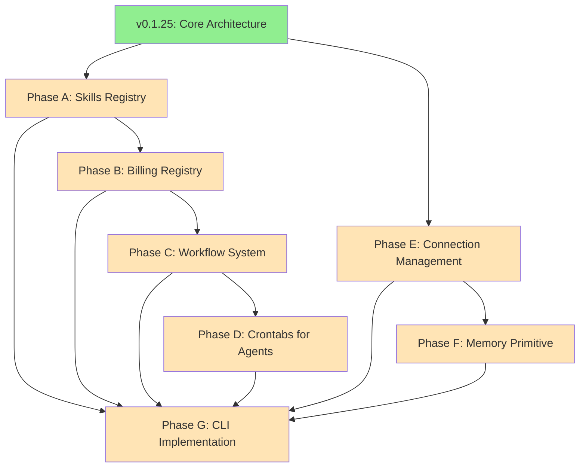

# Universal MCP SDK Roadmap

## 🌟 Overview

Welcome to the Universal MCP SDK Roadmap! This document outlines our strategic vision for building a comprehensive, production-ready SDK for AI agent tooling through the Model Control Protocol (MCP). Our goal is to provide developers with a powerful, extensible framework for building, deploying, and managing AI-powered tools at scale.

**Versioning Strategy**: We follow [Semantic Versioning 2.0.0](https://semver.org/):
- **MAJOR** (X.0.0): Breaking API changes
- **MINOR** (0.X.0): New features, backward compatible
- **PATCH** (0.0.X): Bug fixes and minor improvements

Current development follows a phased approach, with each phase building upon the previous one to create a cohesive ecosystem.

---

## 📦 Current Version (v0.1.25)

### ✅ Completed: Core Architecture Refactoring

The v0.1.x series established the foundational architecture for Universal MCP:

**Key Achievements:**
- **🏗️ Modular Architecture**: Clean separation of concerns with distinct modules for apps, integrations, servers, stores, and tools
- **🔌 MCP Integration**: Full support for Model Control Protocol server architecture with stdio/SSE transports
- **🔑 Credential Management**: Flexible storage system supporting disk, memory, environment variables, and system keyring
- **🛠️ Tool Framework**: Robust tool registration with Pydantic validation, automatic docstring parsing, and format conversion (MCP ↔ LangChain ↔ OpenAI)
- **📚 Application Framework**: Extensible base classes for building app integrations with minimal boilerplate
- **🌐 API Key Authentication**: Built-in support for API key-based authentication patterns
- **📖 Comprehensive Documentation**: Complete docs for all major components, API references, and migration guides
- **🧪 Testing Infrastructure**: Pytest-based test suite with async support

**Applications Available:**
- GitHub, Google Calendar, Gmail, Reddit, Tavily, ZenQuotes, and more

**What's Next**: With the core architecture stable, we're ready to build advanced features on top of this foundation.

---

## 🚀 Future Roadmap

### Phase A: Skills Registry 🎯

**Target**: v0.2.0 - v0.3.0
**Status**: 🔄 Planning
**Dependencies**: None (builds on current architecture)

#### Vision
Create a marketplace-like system for discovering, sharing, and executing reusable agent skills. Skills are composable units of AI behavior that can be registered, versioned, and executed across different agents and applications.

#### Key Features

##### 1. Skill Model & Definition
```python
# Example skill definition
Skill(
    id="sentiment-analysis",
    name="Sentiment Analyzer",
    version="1.0.0",
    description="Analyze text sentiment using multiple models",
    author="community",
    parameters={...},
    required_tools=["openai", "anthropic"],
    execution_strategy="parallel",
    metadata={...}
)
```

**Components:**
- 📋 **Skill Schema**: Pydantic models for skill definitions with validation
- 🏷️ **Versioning**: Semantic versioning for skills with upgrade paths
- 📝 **Metadata**: Author, license, tags, requirements, and usage stats
- 🔗 **Dependencies**: Declare required tools, models, and other skills
- 📊 **Execution Strategies**: Support for sequential, parallel, and conditional execution

##### 2. SkillsRegistry
```python
# Registry operations
registry = SkillsRegistry()
registry.register(skill)
skill = registry.get("sentiment-analysis", version="1.0.0")
skills = registry.search(tags=["nlp", "analysis"])
```

**Features:**
- 🔍 **Discovery**: Search by name, tags, author, or capabilities
- 📦 **Packaging**: Export/import skills as portable bundles
- 🔄 **Updates**: Automatic update checks and migration support
- 🏆 **Ratings**: Community ratings and usage statistics
- 🔐 **Verification**: Cryptographic signatures for trusted skills

##### 3. Skill Execution Engine
```python
# Execute a skill
result = await executor.execute_skill(
    skill_id="sentiment-analysis",
    inputs={"text": "I love this product!"},
    context={...}
)
```

**Features:**
- ⚡ **Dynamic Loading**: Load and cache skills on-demand
- 🔄 **State Management**: Maintain execution state across steps
- 🛡️ **Sandboxing**: Isolated execution environments for security
- 📊 **Monitoring**: Real-time execution metrics and logging
- 🔁 **Retry Logic**: Configurable retry policies for failures

##### 4. Skill Marketplace & Sharing
```python
# Publish to marketplace
publisher.publish(skill, visibility="public")

# Install from marketplace
installer.install("community/sentiment-analysis")
```

**Features:**
- 🌐 **Public Registry**: Central repository for community skills
- 🏢 **Private Registries**: Enterprise-hosted skill repositories
- 📈 **Analytics**: Download counts, usage patterns, performance metrics
- 💬 **Community**: Comments, discussions, and issue tracking
- 🎓 **Documentation**: Auto-generated docs from skill definitions

#### Benefits
- 🚀 **Faster Development**: Reuse proven skills instead of building from scratch
- 🤝 **Knowledge Sharing**: Learn from community best practices
- 📦 **Composability**: Combine skills to create complex behaviors
- 🔄 **Consistency**: Standardized skill interface across all agents
- 🎯 **Specialization**: Focus on domain-specific skills

#### Implementation Phases
1. **Core Registry (v0.2.0)**: Basic skill model, local registry, and execution
2. **Marketplace (v0.2.5)**: Public registry, search, and discovery
3. **Advanced Features (v0.3.0)**: Private registries, analytics, and versioning

---

### Phase B: Billing Registry 💰

**Target**: v0.3.0 - v0.4.0
**Status**: 🔄 Planning
**Dependencies**: Skills Registry (Phase A)

#### Vision
Comprehensive usage tracking and billing system for monitoring costs, optimizing resource usage, and enabling transparent billing for tool and skill execution. Essential for production deployments and cost management.

#### Key Features

##### 1. UsageRecord Model
```python
# Usage tracking
UsageRecord(
    id="rec_123",
    timestamp=datetime.now(),
    entity_type="skill",  # tool, app, skill, workflow
    entity_id="sentiment-analysis",
    user_id="user_123",
    metrics={
        "tokens": 1500,
        "api_calls": 3,
        "duration_ms": 450,
        "cost_usd": 0.0225
    },
    metadata={...}
)
```

**Components:**
- 📊 **Metrics Model**: Extensible metrics for tokens, API calls, compute time, storage
- 🏷️ **Entity Types**: Track usage across tools, skills, workflows, and apps
- 👤 **User Attribution**: Per-user usage tracking for multi-tenant scenarios
- 📍 **Context Capture**: Environment, model, configuration details
- 💾 **Storage**: Efficient time-series storage for historical data

##### 2. BillingRegistry
```python
# Registry operations
registry = BillingRegistry()
registry.record(usage_record)
total = registry.get_cost(user_id="user_123", period="month")
breakdown = registry.get_breakdown(group_by="entity_type")
```

**Features:**
- 📈 **Aggregation**: Roll-up usage by time period, user, entity, or custom dimensions
- 💵 **Cost Calculation**: Convert metrics to costs using configurable pricing models
- 🎯 **Quotas**: Define and enforce usage quotas per user or organization
- 📊 **Reporting**: Generate detailed usage reports and invoices
- ⚠️ **Alerts**: Notify when approaching quotas or anomalous usage

##### 3. Cost Tracking System
```python
# Configure pricing
pricing = PricingModel(
    tokens={"input": 0.01, "output": 0.03},  # per 1K tokens
    api_calls=0.001,  # per call
    compute_hours=0.50  # per hour
)

# Track costs in real-time
with cost_tracker.track(user_id="user_123", entity="skill:sentiment"):
    result = await execute_skill(...)
    # Costs automatically recorded
```

**Features:**
- 💳 **Pricing Models**: Flexible pricing based on usage metrics
- 🔄 **Real-Time Tracking**: Stream costs as operations execute
- 📊 **Cost Attribution**: Trace costs back to specific operations
- 🎛️ **Cost Controls**: Budget limits, rate limiting, and throttling
- 📉 **Optimization**: Identify cost-saving opportunities

##### 4. Analytics & Reporting
```python
# Generate reports
report = analytics.generate_report(
    user_id="user_123",
    start_date="2025-01-01",
    end_date="2025-01-31",
    format="pdf"
)

# Visualize trends
dashboard.show_trends(metrics=["cost", "tokens", "api_calls"])
```

**Features:**
- 📈 **Dashboards**: Interactive visualizations of usage and costs
- 📊 **Trends**: Identify patterns and anomalies over time
- 🔍 **Drill-Down**: Explore costs at granular levels
- 📄 **Export**: CSV, JSON, PDF reports for external systems
- 🤖 **Insights**: AI-powered recommendations for cost optimization

#### Benefits
- 💰 **Cost Transparency**: Clear visibility into where money is spent
- 🎯 **Budget Control**: Prevent cost overruns with quotas and alerts
- 📊 **Usage Insights**: Understand how tools and skills are being used
- 💳 **Billing**: Support usage-based billing for SaaS offerings
- 🔧 **Optimization**: Data-driven decisions to reduce costs

#### Implementation Phases
1. **Core Tracking (v0.3.0)**: Basic usage recording and storage
2. **Cost Calculation (v0.3.5)**: Pricing models and cost attribution
3. **Analytics (v0.4.0)**: Reporting, dashboards, and insights

---

### Phase C: Workflow System 🔄

**Target**: v0.4.0 - v0.5.0
**Status**: 🔄 Planning
**Dependencies**: Skills Registry (Phase A), Billing Registry (Phase B)

#### Vision
Powerful workflow orchestration for chaining tools, skills, and applications into complex, multi-step processes. Enable developers to build sophisticated agent behaviors with conditional logic, error handling, and parallel execution.

#### Key Features

##### 1. Workflow Definition Language
```yaml
# Example workflow definition
name: customer-onboarding
version: 1.0.0
description: Automated customer onboarding workflow

inputs:
  email: string
  name: string
  company: string

steps:
  - id: validate-email
    skill: email-validator
    inputs:
      email: ${{ inputs.email }}

  - id: create-account
    tool: database.create_user
    inputs:
      email: ${{ inputs.email }}
      name: ${{ inputs.name }}
    depends_on: [validate-email]

  - id: send-welcome
    app: gmail.send_email
    parallel: true
    inputs:
      to: ${{ inputs.email }}
      subject: "Welcome!"
      body: ${{ templates.welcome }}

  - id: create-calendar-event
    app: google-calendar.create_event
    parallel: true
    inputs:
      title: "Onboarding Call - ${{ inputs.name }}"
      attendees: [${{ inputs.email }}]

outputs:
  user_id: ${{ steps.create-account.result.id }}
  status: success
```

**Components:**
- 📝 **YAML/JSON Format**: Human-readable workflow definitions
- 🔗 **Step Orchestration**: Define execution order with dependencies
- 📊 **Data Flow**: Pass data between steps using expressions
- 🎭 **Templates**: Reusable templates with variable substitution
- 📚 **Schema Validation**: Validate workflows before execution

##### 2. Workflow Engine
```python
# Execute workflows
engine = WorkflowEngine()
result = await engine.execute(
    workflow="customer-onboarding",
    inputs={"email": "user@example.com", ...},
    context={...}
)
```

**Features:**
- ⚡ **Execution**: Orchestrate complex multi-step workflows
- 🔄 **State Management**: Track execution progress and state
- 📊 **Monitoring**: Real-time visibility into workflow execution
- 🛡️ **Isolation**: Sandbox workflow execution for security
- 💾 **Persistence**: Save and resume long-running workflows

##### 3. Conditional Logic & Branching
```yaml
steps:
  - id: analyze-sentiment
    skill: sentiment-analysis
    inputs:
      text: ${{ inputs.feedback }}

  - id: route-feedback
    type: conditional
    condition: ${{ steps.analyze-sentiment.result.score < 0.3 }}
    then:
      - id: escalate
        app: slack.send_message
        inputs:
          channel: "#urgent"
          text: "Negative feedback alert!"
    else:
      - id: archive
        tool: database.store_feedback
        inputs:
          feedback: ${{ inputs.feedback }}
```

**Features:**
- 🔀 **Conditionals**: If/else branching based on step results
- 🔁 **Loops**: Iterate over collections or repeat until condition
- 🎯 **Dynamic Routing**: Choose paths based on runtime data
- 🔍 **Expressions**: Rich expression language for conditions
- 📊 **Switch/Case**: Multi-way branching for complex logic

##### 4. Error Handling & Retries
```yaml
steps:
  - id: call-external-api
    tool: http.post
    inputs:
      url: "https://api.example.com/data"
      body: ${{ inputs.payload }}
    error_handling:
      strategy: retry
      max_attempts: 3
      backoff: exponential
      retry_on: [timeout, 5xx]
      fallback:
        - id: log-error
          app: logger.error
          inputs:
            message: "API call failed after retries"
```

**Features:**
- 🔁 **Retry Logic**: Configurable retry policies with backoff
- 🛡️ **Error Catching**: Try/catch blocks for graceful degradation
- 🔄 **Fallbacks**: Alternative paths when steps fail
- 📊 **Error Types**: Match errors by type or pattern
- 🚨 **Notifications**: Alert on failures via email, Slack, etc.

##### 5. Parallel Execution
```yaml
steps:
  - id: fetch-data
    type: parallel
    max_concurrency: 5
    steps:
      - id: fetch-github
        app: github.get_repos
      - id: fetch-calendar
        app: google-calendar.list_events
      - id: fetch-emails
        app: gmail.list_messages

  - id: aggregate-results
    skill: data-aggregator
    inputs:
      github: ${{ steps.fetch-data.results.fetch-github }}
      calendar: ${{ steps.fetch-data.results.fetch-calendar }}
      emails: ${{ steps.fetch-data.results.fetch-emails }}
    depends_on: [fetch-data]
```

**Features:**
- ⚡ **Parallel Steps**: Execute independent steps concurrently
- 🎛️ **Concurrency Control**: Limit parallelism to avoid overload
- 🔄 **Result Aggregation**: Collect results from parallel branches
- ⏱️ **Timeouts**: Set deadlines for parallel execution
- 🚦 **Synchronization**: Wait for all/any parallel steps to complete

#### Benefits
- 🏗️ **Complex Behaviors**: Build sophisticated multi-step processes
- 🔄 **Reusability**: Define workflows once, use everywhere
- 🛡️ **Reliability**: Built-in error handling and retries
- ⚡ **Performance**: Parallel execution for faster results
- 📊 **Visibility**: Track workflow progress and debug issues

#### Implementation Phases
1. **Core Engine (v0.4.0)**: Basic workflow execution and orchestration
2. **Advanced Logic (v0.4.5)**: Conditionals, loops, and error handling
3. **Optimization (v0.5.0)**: Parallel execution and performance tuning

---

### Phase D: Crontabs for Agents ⏰

**Target**: v0.5.0 - v0.6.0
**Status**: 🔄 Planning
**Dependencies**: Workflow System (Phase C)

#### Vision
Enable scheduled task execution for agents with cron-like syntax. Allow agents to run workflows, skills, and tools on recurring schedules for automation, monitoring, and maintenance tasks.

#### Key Features

##### 1. Cron Expression Support
```python
# Schedule tasks with cron syntax
scheduler.schedule(
    name="daily-report",
    workflow="generate-analytics-report",
    cron="0 9 * * *",  # Daily at 9 AM
    timezone="America/New_York",
    enabled=True
)

# Common patterns
scheduler.schedule("hourly-sync", workflow="sync-data", cron="0 * * * *")
scheduler.schedule("weekly-backup", workflow="backup-database", cron="0 2 * * 0")
scheduler.schedule("every-5-min", workflow="health-check", cron="*/5 * * * *")
```

**Components:**
- 📅 **Cron Parser**: Support standard cron syntax with extensions
- 🌍 **Timezone Support**: Schedule in any timezone
- 🔄 **Recurring Schedules**: Run tasks at regular intervals
- 📊 **Schedule Validation**: Validate cron expressions before saving
- 🎯 **Named Schedules**: Human-readable names for schedules

##### 2. Job Scheduler
```python
# Advanced scheduling
scheduler = JobScheduler()

# One-time execution
scheduler.schedule_once(
    name="onboarding-followup",
    workflow="send-followup-email",
    run_at=datetime(2025, 2, 10, 14, 30),
    inputs={"user_id": "123"}
)

# Conditional scheduling
scheduler.schedule_conditional(
    name="scale-resources",
    workflow="scale-infrastructure",
    cron="*/10 * * * *",
    condition=lambda ctx: ctx.load_avg > 0.8
)
```

**Features:**
- ⏰ **Flexible Scheduling**: Cron, one-time, interval-based
- 🎛️ **Job Control**: Start, stop, pause, and resume jobs
- 🔄 **Missed Runs**: Handle missed runs (skip, run immediately, or queue)
- 🎯 **Overlapping Jobs**: Control behavior when previous run hasn't finished
- 🔐 **Permissions**: Role-based access control for schedule management

##### 3. Task Persistence & State
```python
# Job persistence
job = Job(
    id="job_123",
    name="daily-backup",
    workflow_id="backup-workflow",
    schedule="0 2 * * *",
    last_run=datetime(2025, 2, 4, 2, 0),
    next_run=datetime(2025, 2, 5, 2, 0),
    status="completed",
    run_count=45,
    metadata={...}
)

# Query jobs
jobs = scheduler.list_jobs(status="active")
history = scheduler.get_job_history(job_id="job_123", limit=10)
```

**Features:**
- 💾 **Persistent Storage**: Jobs survive server restarts
- 📊 **Run History**: Track all executions with results
- 🔍 **Job Discovery**: List and search scheduled jobs
- 📈 **Statistics**: Success rate, average duration, failure patterns
- 🔄 **State Recovery**: Resume interrupted jobs after failures

##### 4. Execution History & Logs
```python
# View execution history
history = scheduler.get_execution_history(
    job_id="job_123",
    start_date="2025-01-01",
    end_date="2025-01-31"
)

for run in history:
    print(f"Run {run.id}: {run.status} in {run.duration}ms")
    print(f"Logs: {run.logs}")
    print(f"Result: {run.result}")
```

**Features:**
- 📜 **Execution Logs**: Detailed logs for each run
- 📊 **Metrics**: Duration, resource usage, costs per run
- 🎯 **Filtering**: Filter by date, status, or job
- 🔍 **Search**: Full-text search across logs
- 📥 **Export**: Download logs and results for analysis

##### 5. Agent-Specific Scheduling
```python
# Schedule per-agent tasks
agent_scheduler = AgentScheduler(agent_id="agent_123")

agent_scheduler.schedule(
    name="check-inbox",
    workflow="process-emails",
    cron="*/15 * * * *",  # Every 15 minutes
    agent_context={
        "email": "agent@example.com",
        "preferences": {...}
    }
)

# Pause agent schedules
agent_scheduler.pause_all()
agent_scheduler.resume_all()
```

**Features:**
- 👤 **Per-Agent Schedules**: Each agent has isolated schedules
- 🎛️ **Agent Context**: Pass agent-specific data to workflows
- 🔄 **Lifecycle Management**: Pause/resume all schedules for an agent
- 📊 **Agent Analytics**: Track scheduling activity per agent
- 🔐 **Isolation**: Schedules don't interfere across agents

#### Benefits
- ⏰ **Automation**: Automate recurring tasks without manual intervention
- 📊 **Consistency**: Ensure tasks run reliably on schedule
- 🔄 **Maintenance**: Schedule background jobs like cleanups and backups
- 📈 **Monitoring**: Regular health checks and status updates
- 🎯 **Scalability**: Handle thousands of scheduled jobs efficiently

#### Implementation Phases
1. **Core Scheduler (v0.5.0)**: Basic cron support and job execution
2. **Persistence (v0.5.5)**: Job storage and execution history
3. **Advanced Features (v0.6.0)**: Conditional scheduling and agent isolation

---

### Phase E: Connection Management 🔌

**Target**: v0.6.0 - v0.7.0
**Status**: 🔄 Planning
**Dependencies**: None (builds on current architecture)

#### Vision
Separate the concept of Integration (authentication configuration) from Connection (active user sessions). Enable multiple users to connect their own accounts to the same integration, supporting multi-user scenarios and enterprise deployments.

#### Key Features

##### 1. Integration vs Connection Split
```python
# Integration: Configuration template
integration = Integration(
    id="int_github",
    name="GitHub",
    type="oauth2",
    auth_config={
        "client_id": "...",
        "client_secret": "...",
        "scopes": ["repo", "user"]
    }
)

# Connection: User-specific instance
connection = Connection(
    id="conn_123",
    integration_id="int_github",
    user_id="user_456",
    credentials={
        "access_token": "...",
        "refresh_token": "...",
        "expires_at": "..."
    },
    status="active"
)
```

**Components:**
- 🏗️ **Integration Model**: Reusable authentication configuration
- 🔗 **Connection Model**: Per-user credential instances
- 👤 **User Association**: Link connections to specific users
- 📊 **Status Tracking**: Monitor connection health and validity
- 🔄 **Token Management**: Handle token refresh and expiration

##### 2. Multi-User Token Storage
```python
# Store per-user tokens
store = ConnectionStore()
store.save_connection(
    integration_id="int_github",
    user_id="user_456",
    credentials={...}
)

# Retrieve user-specific connection
connection = store.get_connection(
    integration_id="int_github",
    user_id="user_456"
)

# List all user connections
connections = store.list_connections(user_id="user_456")
```

**Features:**
- 💾 **Encrypted Storage**: Secure storage of user tokens
- 👥 **Multi-Tenant**: Isolate credentials by user
- 🔍 **Connection Discovery**: Find connections by user or integration
- 🔄 **Bulk Operations**: Manage multiple connections efficiently
- 🗑️ **Cleanup**: Remove expired or revoked connections

##### 3. Connection Lifecycle
```python
# Create connection
connection = await connector.authorize(
    integration_id="int_github",
    user_id="user_456",
    auth_flow="oauth2"
)

# Refresh tokens
await connector.refresh_connection(connection_id="conn_123")

# Validate connection
is_valid = await connector.validate_connection(connection_id="conn_123")

# Revoke connection
await connector.revoke_connection(connection_id="conn_123")
```

**Features:**
- 🔐 **Authorization Flows**: Support OAuth2, OAuth1, API keys
- 🔄 **Token Refresh**: Automatic token refresh before expiration
- ✅ **Validation**: Test connection validity periodically
- 🚫 **Revocation**: Cleanly disconnect user accounts
- 📊 **Events**: Emit events on connection state changes

##### 4. Connection Health Monitoring
```python
# Monitor connection health
monitor = ConnectionMonitor()

# Check specific connection
health = await monitor.check_health(connection_id="conn_123")
# Returns: { "status": "healthy", "last_used": "...", "token_expires": "..." }

# Find stale connections
stale = monitor.find_stale_connections(days=30)

# Alert on expiring tokens
monitor.on_expiring_token(lambda conn: notify_user(conn.user_id))
```

**Features:**
- 🏥 **Health Checks**: Regular validation of connection status
- ⏰ **Expiration Alerts**: Notify before tokens expire
- 📊 **Usage Tracking**: Track when connections are last used
- 🔍 **Anomaly Detection**: Identify unusual connection patterns
- 🔄 **Auto-Refresh**: Automatically refresh expiring tokens

##### 5. Enterprise Features
```python
# Organization-level management
org_manager = OrganizationConnectionManager(org_id="org_123")

# Provision connections for users
await org_manager.provision_connection(
    user_id="user_456",
    integration_id="int_github",
    auto_approve=True
)

# Audit connection usage
audit_log = org_manager.get_audit_log(
    integration_id="int_github",
    start_date="2025-01-01"
)

# Enforce policies
org_manager.set_policy(
    integration_id="int_github",
    policy="require_2fa"
)
```

**Features:**
- 🏢 **Organization Management**: Centralized connection management
- 🔐 **Policy Enforcement**: Require 2FA, limit scopes, etc.
- 📊 **Audit Logging**: Track all connection activities
- 👥 **Bulk Provisioning**: Set up connections for many users
- 🎯 **Approval Workflows**: Admin approval for sensitive integrations

#### Benefits
- 👥 **Multi-User Support**: Multiple users can use the same integration
- 🔒 **Security**: Isolated credentials per user
- 📊 **Visibility**: Track which users have active connections
- 🔄 **Flexibility**: Easy to add/remove user connections
- 🏢 **Enterprise Ready**: Support organizational requirements

#### Implementation Phases
1. **Connection Model (v0.6.0)**: Separate connections from integrations
2. **Multi-User Storage (v0.6.5)**: Per-user credential management
3. **Enterprise Features (v0.7.0)**: Org management and policies

---

### Phase F: Memory Primitive 🧠

**Target**: v0.7.0 - v0.8.0
**Status**: 🔄 Planning
**Dependencies**: Connection Management (Phase E)

#### Vision
Provide cross-agent memory storage to enable context sharing, learning from past interactions, and building persistent agent knowledge. Create a unified memory layer that agents can query and update to maintain state across sessions.

#### Key Features

##### 1. Memory Types
```python
# Short-term memory (session-scoped)
short_term = ShortTermMemory(session_id="sess_123")
short_term.store("user_preference", "dark_mode")
value = short_term.retrieve("user_preference")

# Long-term memory (persistent)
long_term = LongTermMemory(agent_id="agent_456")
long_term.store("learned_pattern", {
    "type": "user_behavior",
    "pattern": "prefers_morning_meetings",
    "confidence": 0.85
})

# Episodic memory (conversation history)
episodic = EpisodicMemory(agent_id="agent_456")
episodic.add_interaction({
    "role": "user",
    "message": "Schedule a meeting for tomorrow",
    "timestamp": "..."
})
```

**Components:**
- 🔄 **Short-Term Memory**: Temporary session data
- 💾 **Long-Term Memory**: Persistent knowledge and facts
- 📚 **Episodic Memory**: Conversation and interaction history
- 🎯 **Semantic Memory**: Concepts, relationships, and reasoning
- 🗂️ **Working Memory**: Active context during task execution

##### 2. Vector Storage & Embeddings
```python
# Store with embeddings
memory = VectorMemory(agent_id="agent_456")
await memory.store(
    content="The user prefers Python for backend work",
    metadata={"type": "preference", "domain": "programming"},
    embedding_model="text-embedding-3-small"
)

# Semantic search
results = await memory.search(
    query="What languages does the user like?",
    top_k=5,
    min_similarity=0.7
)

for result in results:
    print(f"Memory: {result.content} (score: {result.similarity})")
```

**Features:**
- 🔍 **Semantic Search**: Find relevant memories by meaning
- 📊 **Embedding Models**: Support multiple embedding providers
- 🎯 **Similarity Scoring**: Rank results by relevance
- 🔄 **Auto-Embedding**: Automatically embed stored content
- 📈 **Index Optimization**: Efficient vector search with HNSW/IVF

##### 3. Memory Querying & Retrieval
```python
# Query interface
memory = Memory(agent_id="agent_456")

# Structured queries
results = memory.query(
    filters={"type": "user_preference", "domain": "scheduling"},
    order_by="timestamp",
    limit=10
)

# Natural language queries
results = memory.ask("What do I know about the user's meeting preferences?")

# Contextual retrieval
context = memory.get_context(
    current_task="schedule_meeting",
    max_tokens=1000
)
```

**Features:**
- 🔍 **Flexible Queries**: Filter by metadata, time, or relevance
- 💬 **Natural Language**: Query memory in plain English
- 🎯 **Context Assembly**: Build relevant context for tasks
- 📊 **Ranking**: Prioritize most relevant memories
- 🔄 **Dynamic Updates**: Memory updates reflected immediately

##### 4. Cross-Agent Memory Sharing
```python
# Shared memory space
shared_memory = SharedMemory(namespace="team_knowledge")

# Agent A stores knowledge
await shared_memory.store(
    agent_id="agent_a",
    content="Client X prefers weekly status updates",
    tags=["client_x", "communication"]
)

# Agent B retrieves knowledge
memories = await shared_memory.search(
    query="How should I communicate with Client X?",
    exclude_agents=["agent_b"]  # Don't return agent B's own memories
)

# Memory permissions
shared_memory.grant_access(
    agent_id="agent_c",
    namespace="team_knowledge",
    permission="read"
)
```

**Features:**
- 🤝 **Memory Sharing**: Agents share knowledge and context
- 🔐 **Access Control**: Fine-grained permissions per agent
- 🏷️ **Namespaces**: Organize memories by domain or team
- 🔍 **Cross-Agent Search**: Search across all agents' memories
- 📊 **Provenance**: Track which agent created each memory

##### 5. Memory Consolidation & Learning
```python
# Consolidate memories
consolidator = MemoryConsolidator(agent_id="agent_456")

# Merge similar memories
await consolidator.consolidate(
    strategy="merge_similar",
    similarity_threshold=0.9
)

# Extract patterns
patterns = await consolidator.extract_patterns(
    memory_type="user_interaction",
    min_frequency=5
)

# Prune old memories
await consolidator.prune(
    strategy="keep_important",
    max_age_days=90,
    importance_threshold=0.7
)
```

**Features:**
- 🔄 **Automatic Consolidation**: Merge duplicate or similar memories
- 📊 **Pattern Extraction**: Discover recurring themes and behaviors
- 🗑️ **Memory Pruning**: Remove outdated or irrelevant memories
- 🎯 **Importance Scoring**: Rank memories by relevance and utility
- 🧠 **Knowledge Distillation**: Compress memories while retaining key info

#### Benefits
- 🧠 **Persistent Knowledge**: Agents remember across sessions
- 🤝 **Collaboration**: Agents share insights and learnings
- 🎯 **Personalization**: Adapt behavior based on history
- 📊 **Context Awareness**: Maintain relevant context for tasks
- 🔄 **Continuous Learning**: Improve over time from interactions

#### Implementation Phases
1. **Core Memory (v0.7.0)**: Basic storage and retrieval
2. **Vector Search (v0.7.5)**: Semantic search with embeddings
3. **Advanced Features (v0.8.0)**: Cross-agent sharing and consolidation

---

### Phase G: CLI Implementation 🖥️

**Target**: v0.8.0 - v0.9.0
**Status**: 🔄 Planning
**Dependencies**: All previous phases (CLI provides interface to all features)

#### Vision
Comprehensive command-line interface for managing the entire Universal MCP ecosystem. Provide intuitive commands for configuration, deployment, monitoring, and debugging of servers, apps, integrations, workflows, and more.

#### Key Features

##### 1. Core Commands
```bash
# Server management
universal-mcp server start config.json
universal-mcp server stop
universal-mcp server restart
universal-mcp server status
universal-mcp server logs --follow

# App management
universal-mcp app list
universal-mcp app install github
universal-mcp app enable github
universal-mcp app disable github
universal-mcp app uninstall github

# Integration management
universal-mcp integration list
universal-mcp integration create github --type oauth2
universal-mcp integration configure github
universal-mcp integration test github
```

**Features:**
- 🚀 **Server Control**: Start, stop, restart servers
- 📦 **App Management**: Install, enable, disable applications
- 🔌 **Integration Setup**: Configure authentication
- 📊 **Status Monitoring**: Real-time server status
- 📜 **Log Access**: View and tail server logs

##### 2. Workflow Commands
```bash
# Workflow management
universal-mcp workflow list
universal-mcp workflow create onboarding.yaml
universal-mcp workflow execute customer-onboarding --input email=user@example.com
universal-mcp workflow status wf_123
universal-mcp workflow logs wf_123 --step validate-email
universal-mcp workflow cancel wf_123

# Workflow development
universal-mcp workflow validate onboarding.yaml
universal-mcp workflow test onboarding.yaml --dry-run
universal-mcp workflow export customer-onboarding --format zip
```

**Features:**
- 🔄 **Workflow Execution**: Run workflows from CLI
- 📊 **Status Tracking**: Monitor workflow progress
- 🔍 **Debugging**: View logs and step details
- ✅ **Validation**: Test workflows before deployment
- 📦 **Import/Export**: Share workflows easily

##### 3. Skills Commands
```bash
# Skills management
universal-mcp skill list
universal-mcp skill search --tag nlp
universal-mcp skill info sentiment-analysis
universal-mcp skill install community/sentiment-analysis
universal-mcp skill execute sentiment-analysis --input text="Great product!"
universal-mcp skill publish ./my-skill --visibility public

# Skill development
universal-mcp skill create my-skill --template basic
universal-mcp skill test my-skill
universal-mcp skill validate my-skill
```

**Features:**
- 🔍 **Discovery**: Search and browse skills
- 📦 **Installation**: Install skills from registry
- ⚡ **Execution**: Run skills directly from CLI
- 🚀 **Publishing**: Share skills with community
- 🛠️ **Development**: Scaffold and test new skills

##### 4. Scheduling Commands
```bash
# Job management
universal-mcp schedule list
universal-mcp schedule create daily-backup \
  --workflow backup-database \
  --cron "0 2 * * *" \
  --timezone America/New_York

universal-mcp schedule enable daily-backup
universal-mcp schedule disable daily-backup
universal-mcp schedule delete daily-backup

# Job monitoring
universal-mcp schedule history daily-backup --limit 10
universal-mcp schedule logs daily-backup --run run_456
universal-mcp schedule next-run daily-backup
```

**Features:**
- ⏰ **Schedule Management**: Create and manage cron jobs
- 📊 **Execution History**: View past runs
- 🔍 **Log Access**: Debug failed jobs
- 🎛️ **Job Control**: Enable, disable, delete schedules

##### 5. Monitoring & Analytics
```bash
# Usage monitoring
universal-mcp usage summary --period month
universal-mcp usage breakdown --group-by app
universal-mcp usage costs --user user_123
universal-mcp usage export --format csv --output usage.csv

# Performance monitoring
universal-mcp metrics show --metric response_time
universal-mcp metrics dashboard
universal-mcp metrics alerts

# Health checks
universal-mcp health check
universal-mcp health connections
universal-mcp health memory
```

**Features:**
- 📊 **Usage Reports**: View usage and costs
- 📈 **Metrics**: Monitor performance metrics
- 🏥 **Health Checks**: Verify system health
- 🔔 **Alerts**: Configure usage alerts
- 📥 **Export**: Download reports for analysis

##### 6. Development Tools
```bash
# App generation
universal-mcp generate app my-api --template rest
universal-mcp generate integration my-service --type oauth2
universal-mcp generate tool my-function --app my-api

# Testing
universal-mcp test app my-api
universal-mcp test integration my-service
universal-mcp test workflow my-workflow.yaml

# Documentation
universal-mcp docs generate
universal-mcp docs serve --port 8080
```

**Features:**
- 🏗️ **Scaffolding**: Generate boilerplate code
- 🧪 **Testing**: Run tests from CLI
- 📚 **Documentation**: Generate and serve docs
- 🔧 **Development Mode**: Hot-reload for iteration
- 📊 **Validation**: Lint and validate code

##### 7. Configuration Management
```bash
# Config management
universal-mcp config show
universal-mcp config edit
universal-mcp config validate config.json
universal-mcp config migrate --from 0.1.x --to 0.2.0

# Environment management
universal-mcp env list
universal-mcp env create production --from config.json
universal-mcp env switch production
universal-mcp env delete staging
```

**Features:**
- ⚙️ **Config Editing**: Modify configuration
- ✅ **Validation**: Ensure config is valid
- 🔄 **Migration**: Upgrade configs between versions
- 🌍 **Environments**: Manage multiple configs
- 🔐 **Secrets**: Securely manage credentials

#### Benefits
- 🚀 **Developer Friendly**: Intuitive commands for all tasks
- ⚡ **Productivity**: Fast iteration and debugging
- 📊 **Visibility**: Monitor system health and usage
- 🔧 **Automation**: Script repetitive tasks
- 📚 **Documentation**: Built-in help and examples

#### Implementation Phases
1. **Core Commands (v0.8.0)**: Server, app, integration management
2. **Advanced Features (v0.8.5)**: Workflows, skills, scheduling
3. **Monitoring & Dev Tools (v0.9.0)**: Analytics, testing, generation

---

## 📊 Dependency Graph



**Legend:**
- 🟢 Green: Completed
- 🟡 Yellow: Planning/Future

**Key Dependencies:**
- **Phase B** (Billing) depends on **Phase A** (Skills) to track skill usage
- **Phase C** (Workflow) benefits from both **Skills** and **Billing** for orchestration and cost tracking
- **Phase D** (Crontabs) builds on **Workflow** to enable scheduled execution
- **Phase F** (Memory) can be developed in parallel with other phases
- **Phase G** (CLI) is the final integration point, depending on all other phases

**Parallel Development:**
- **Phases A, E** can be developed in parallel (independent)
- **Phases B, C, D** must be sequential (dependencies)
- **Phase F** can be developed anytime after Phase E
- **Phase G** should be last to provide CLI for all features

---

## 🎯 Success Metrics

For each phase, we'll measure success through:

**Technical Metrics:**
- ✅ Feature completeness (% of planned features implemented)
- 🧪 Test coverage (target: >80%)
- 📚 Documentation coverage (all public APIs documented)
- 🐛 Bug density (issues per 1K lines of code)
- ⚡ Performance benchmarks (latency, throughput)

**Adoption Metrics:**
- 👥 Active users/deployments
- 📊 Usage patterns (most-used features)
- 💬 Community engagement (GitHub stars, issues, discussions)
- 🔄 Version adoption rate (% on latest version)
- 📈 Growth metrics (week-over-week)

**Quality Metrics:**
- 📝 API stability (breaking changes per release)
- 🔒 Security vulnerabilities (time to patch)
- 🏥 System health (uptime, error rates)
- 🎯 User satisfaction (NPS, survey results)
- 📚 Documentation quality (user feedback)

---

## 🤝 Contributing

We welcome contributions to any phase of the roadmap! Here's how you can help:

### 1. Phase Development
- Pick a phase that interests you
- Review the phase specification
- Join the discussion in relevant GitHub issues
- Submit PRs for specific features

### 2. Feature Proposals
- Have an idea not on the roadmap? [Open an issue](https://github.com/universal-mcp/universal-mcp/issues/new)
- Use the `feature-request` template
- Explain the use case and proposed design
- Gather community feedback

### 3. Documentation
- Improve existing docs
- Add tutorials and examples
- Translate documentation
- Fix typos and clarity issues

### 4. Testing & Feedback
- Try beta/alpha features
- Report bugs and edge cases
- Suggest UX improvements
- Share real-world use cases

### 5. Community Support
- Answer questions in discussions
- Review pull requests
- Share your Universal MCP projects
- Write blog posts and tutorials

**Getting Started:**
1. Read [CONTRIBUTING.md](CONTRIBUTING.md)
2. Join our [Discord community](#) (coming soon)
3. Check [good first issues](https://github.com/universal-mcp/universal-mcp/issues?q=is%3Aissue+is%3Aopen+label%3A%22good+first+issue%22)
4. Fork, develop, and submit PRs

**Development Workflow:**
```bash
# Clone the repo
git clone https://github.com/universal-mcp/universal-mcp.git
cd universal-mcp

# Install dependencies
uv sync

# Run tests
uv run pytest

# Start coding!
```

---

## 📅 Release Schedule

We aim for regular releases following this cadence:

- **Major releases** (X.0.0): Every 6-12 months
- **Minor releases** (0.X.0): Every 1-2 months
- **Patch releases** (0.0.X): As needed for bugs

**Upcoming Milestones:**
- **v0.2.0** (Q2 2025): Skills Registry Core
- **v0.3.0** (Q3 2025): Billing Registry + Skills Marketplace
- **v0.4.0** (Q4 2025): Workflow System
- **v0.5.0** (Q1 2026): Crontabs for Agents
- **v0.6.0** (Q2 2026): Connection Management
- **v0.7.0** (Q3 2026): Memory Primitive
- **v1.0.0** (Q4 2026): Stable Release + CLI

**Alpha/Beta Policy:**
- New phases released as alpha for early testing
- After 2-4 weeks, promoted to beta
- After another 4-6 weeks and community feedback, stable release

---

## 📣 Stay Informed

Keep up with roadmap updates:

- **GitHub Releases**: Watch for release announcements
- **Discussions**: Join roadmap discussions on GitHub
- **Blog**: Read detailed phase announcements (coming soon)
- **Discord**: Real-time updates and community chat (coming soon)
- **Twitter**: Follow [@universalmcp](#) for news (coming soon)

**Roadmap Changes:**
This roadmap is a living document. Phases may be adjusted based on:
- Community feedback and priorities
- Technical discoveries during development
- Partnership opportunities
- Market needs and trends

Last updated: February 4, 2025

---

## 📜 License

This roadmap and all Universal MCP code is released under the [MIT License](LICENSE).

---

**Built with ❤️ by the Universal MCP community**

[⭐ Star us on GitHub](https://github.com/universal-mcp/universal-mcp) | [📚 Documentation](https://docs.universal-mcp.dev) | [💬 Join Discord](#)
