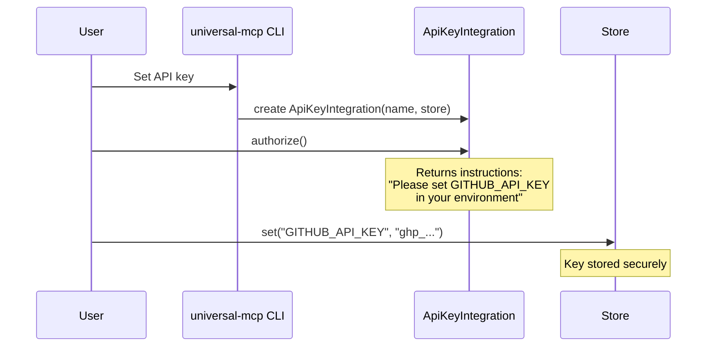
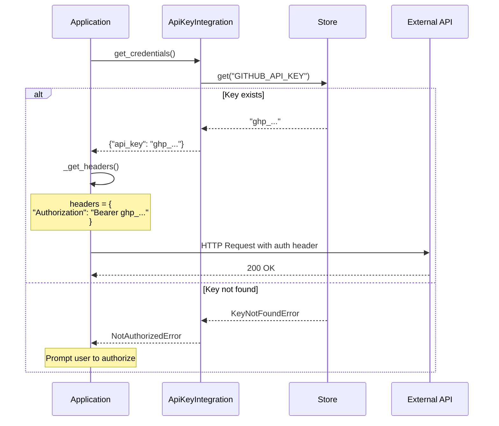
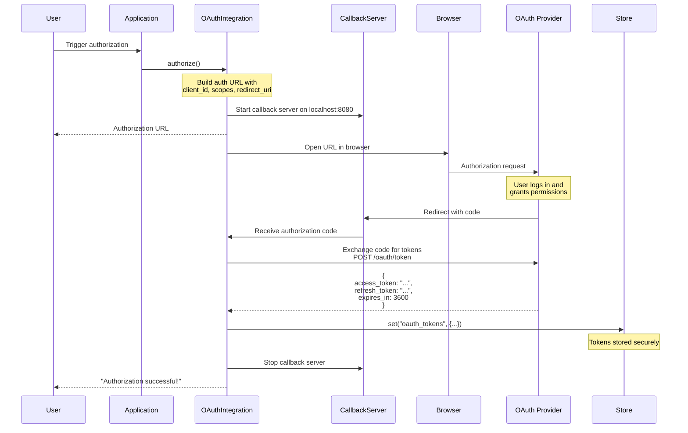
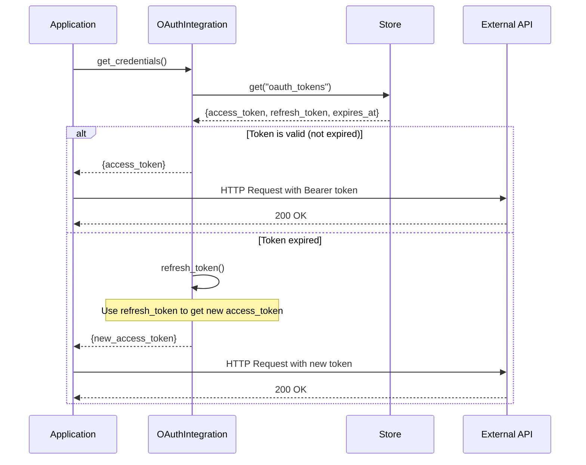
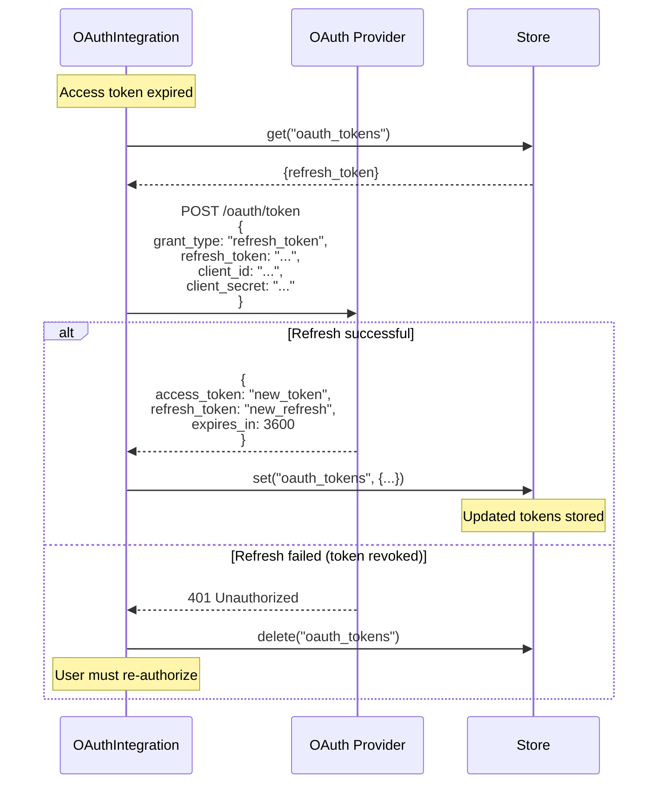
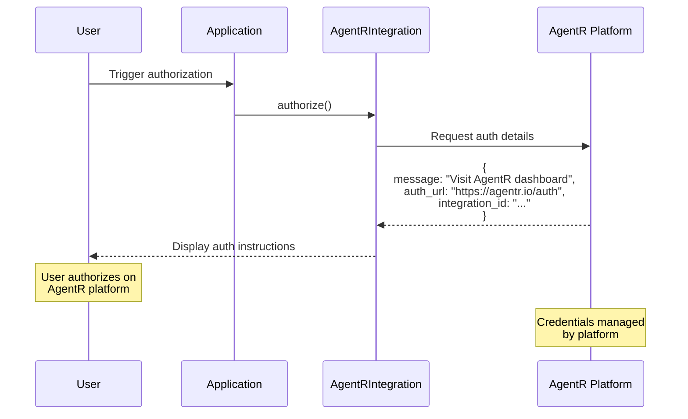
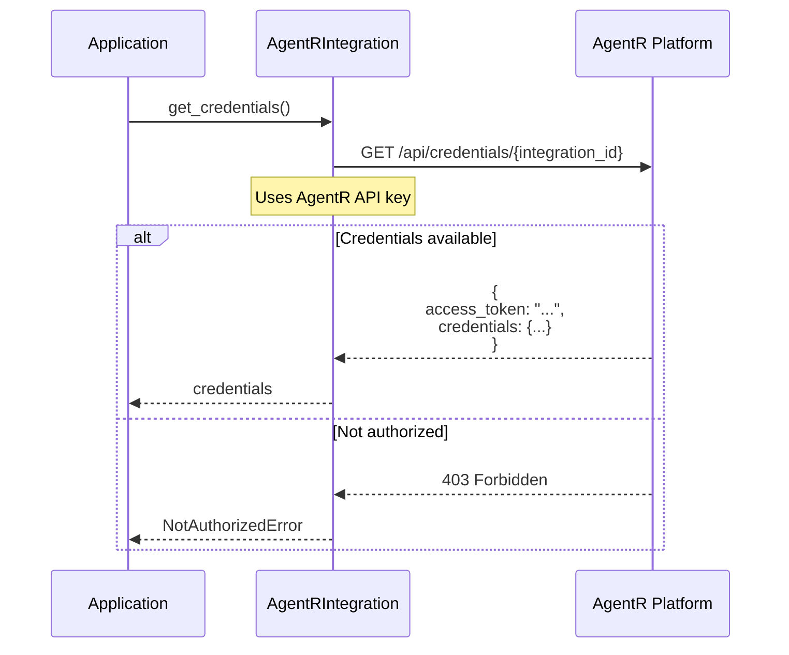
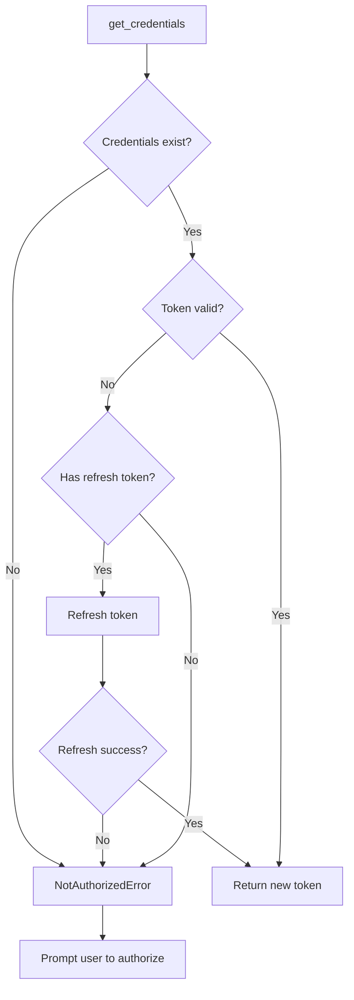

# Authentication Flow

This page details the three authentication patterns supported by universal-mcp: API Key, OAuth 2.0, and AgentR platform integration.

## Overview

Universal-mcp supports multiple authentication strategies through the Integration abstraction:

1. **API Key Authentication** - Simple token-based auth
2. **OAuth 2.0 Authentication** - Full OAuth flow with token refresh
3. **AgentR Integration** - Platform-managed credentials

## API Key Authentication

The simplest authentication method: store an API key and inject it into requests.

### Setup Flow



### Request Flow



### Configuration Example

```yaml
applications:
  - name: github
    module: github_app
    integration:
      type: api_key
      api_key_name: GITHUB_API_KEY
      headers:
        Authorization: "Bearer {api_key}"
```

### Key Storage Options

| Store Type | Usage | Security |
|------------|-------|----------|
| EnvironmentStore | Environment variable | Low - visible in process list |
| KeyringStore | System keyring | High - encrypted by OS |
| MemoryStore | In-process only | Medium - lost on restart |

## OAuth 2.0 Authentication

Full OAuth 2.0 authorization code flow with automatic token refresh.

### Initial Authorization Flow



### Token Usage Flow



### Token Refresh Flow



### Configuration Example

```yaml
applications:
  - name: slack
    module: slack_app
    integration:
      type: oauth
      client_id: ${SLACK_CLIENT_ID}
      client_secret: ${SLACK_CLIENT_SECRET}
      auth_url: https://slack.com/oauth/authorize
      token_url: https://slack.com/api/oauth.access
      scopes:
        - chat:write
        - channels:read
      callback_port: 8080
```

### OAuth Components

**OAuthIntegration** manages:
- Authorization URL generation
- Callback server (receives OAuth code)
- Token exchange (code → access_token)
- Token refresh (refresh_token → new access_token)
- Token storage

**CallbackServer** (internal):
- Temporary HTTP server on localhost
- Receives OAuth redirect
- Extracts authorization code
- Shuts down after successful callback

## AgentR Platform Integration

Delegates credential management to the AgentR platform.

### Authorization Flow



### Credential Retrieval Flow



### Configuration Example

```yaml
applications:
  - name: gmail
    module: gmail_app
    integration:
      type: agentr
      integration_id: gmail_integration_123
      agentr_api_key: ${AGENTR_API_KEY}
```

### Benefits of AgentR

1. **Centralized Management**: All credentials in one platform
2. **Security**: Credentials never stored locally
3. **Sharing**: Team members share access without sharing credentials
4. **Audit**: Platform tracks credential usage
5. **Rotation**: Automatic credential rotation

## Comparison Matrix

| Feature | API Key | OAuth 2.0 | AgentR |
|---------|---------|-----------|---------|
| **Setup Complexity** | Low | Medium | Low |
| **Security** | Medium | High | High |
| **Token Refresh** | Manual | Automatic | Automatic |
| **User Experience** | Copy/paste key | Browser flow | Browser flow |
| **Revocation** | Manual | Automatic | Platform-managed |
| **Sharing** | Share key (insecure) | Each user authorizes | Platform sharing |
| **Best For** | Development, personal tools | Production OAuth apps | Enterprise, teams |

## Store Selection Guide

Different stores are appropriate for different scenarios:

### MemoryStore
- **Use for**: Testing, development
- **Pros**: Fast, no setup
- **Cons**: Lost on restart
- **Security**: Low (in-process memory)

### EnvironmentStore
- **Use for**: CI/CD, containerized deployments
- **Pros**: Standard 12-factor approach
- **Cons**: Visible in process environment
- **Security**: Medium (process isolation)

### KeyringStore
- **Use for**: Production, local development
- **Pros**: Secure, persistent, encrypted by OS
- **Cons**: Requires system keyring
- **Security**: High (OS-level encryption)

## Error Handling

Common authentication errors and how they're handled:



### Exception Hierarchy

- `NotAuthorizedError`: No credentials found
- `KeyNotFoundError`: Specific key missing from store
- `TokenExpiredError`: Token expired and no refresh available
- `OAuthError`: OAuth flow error (user denied, invalid client, etc.)

## Related Documentation

- [Request Flow](request-flow.md) - How auth fits into the request lifecycle
- [Integrations API](../api/integrations.md) - Integration class reference
- [Stores API](../api/stores.md) - Store class reference
