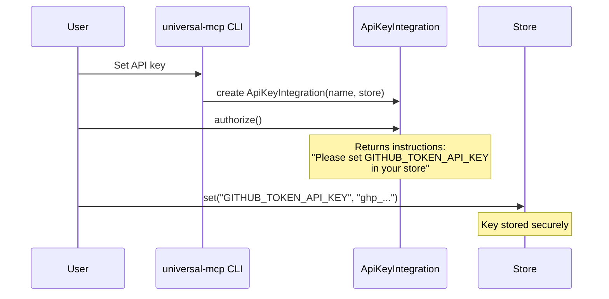
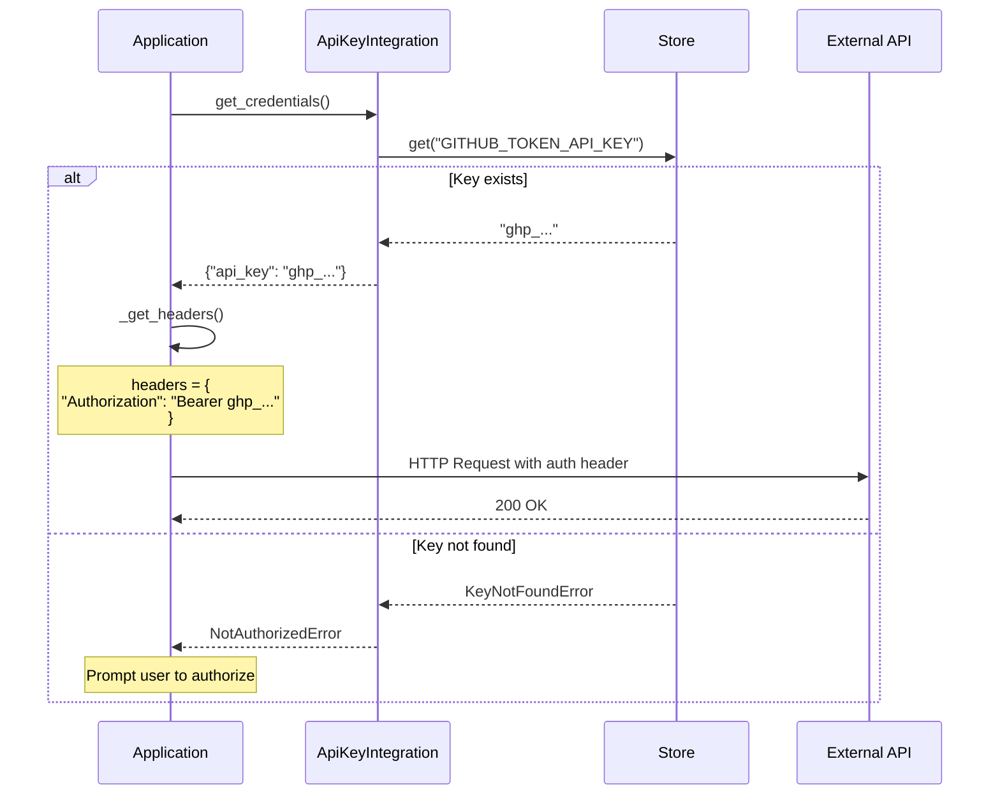
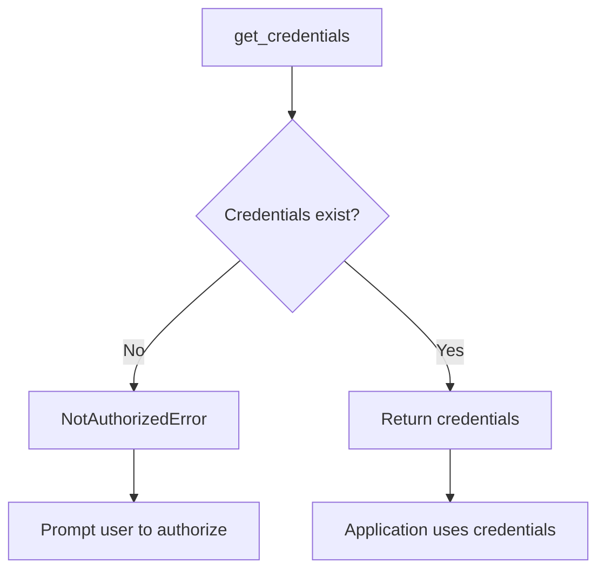

# Authentication Flow

This page details the API key authentication pattern supported by universal-mcp.

## Overview

Universal-mcp uses API key-based authentication through the Integration abstraction. This provides a simple, secure approach appropriate for single-user SDK deployments.

## API Key Authentication

The primary authentication method: store an API key and inject it into requests.

### Setup Flow



### Request Flow



### Configuration Example

```json
{
  "apps": [
    {
      "name": "github",
      "integration": {
        "name": "GITHUB_TOKEN",
        "type": "api_key",
        "store": {
          "type": "disk"
        }
      }
    }
  ]
}
```

### Key Storage Options

| Store Type | Usage | Security | Persistence |
|------------|-------|----------|-------------|
| DiskStore | File-based storage | Medium - plaintext JSON | Persistent |
| EnvironmentStore | Environment variable | Low - visible in process list | Session-based |
| KeyringStore | System keyring | High - encrypted by OS | Persistent |
| MemoryStore | In-process only | Medium - lost on restart | None |

## Store Selection Guide

Different stores are appropriate for different scenarios:

### DiskStore (Default)
- **Use for**: Local development, single-user deployments
- **Pros**: Simple, persistent, portable
- **Cons**: Plaintext storage
- **Security**: Medium (file system permissions)
- **Location**: `~/.universal-mcp/store/`

### EnvironmentStore
- **Use for**: CI/CD, containerized deployments
- **Pros**: Standard 12-factor approach
- **Cons**: Visible in process environment
- **Security**: Medium (process isolation)

### KeyringStore
- **Use for**: Production, security-sensitive deployments
- **Pros**: Secure, persistent, encrypted by OS
- **Cons**: Requires system keyring
- **Security**: High (OS-level encryption)

### MemoryStore
- **Use for**: Testing, development
- **Pros**: Fast, no setup
- **Cons**: Lost on restart
- **Security**: Low (in-process memory)

## Error Handling

Common authentication errors and how they're handled:



### Exception Hierarchy

- `NotAuthorizedError`: No credentials found
- `KeyNotFoundError`: Specific key missing from store

## Credential Setup Examples

### Using DiskStore (Programmatic)

```python
from universal_mcp.stores import DiskStore

store = DiskStore()
store.set("GITHUB_TOKEN_API_KEY", "ghp_your_token_here")
```

### Using Environment Variables

```bash
export GITHUB_TOKEN_API_KEY="ghp_your_token_here"
```

### Using Keyring

```python
from universal_mcp.stores import KeyringStore

store = KeyringStore(app_name="my_app")
store.set("GITHUB_TOKEN_API_KEY", "ghp_your_token_here")
```

## Related Documentation

- [Request Flow](request-flow.md) - How auth fits into the request lifecycle
- [Integrations API](../api/integrations.md) - Integration class reference
- [Stores API](../api/stores.md) - Store class reference
