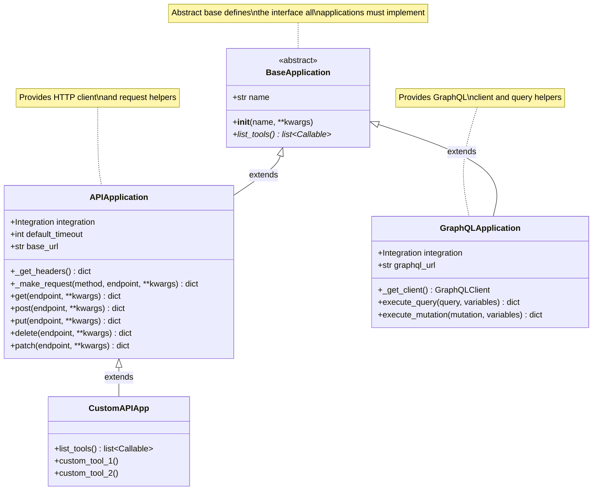
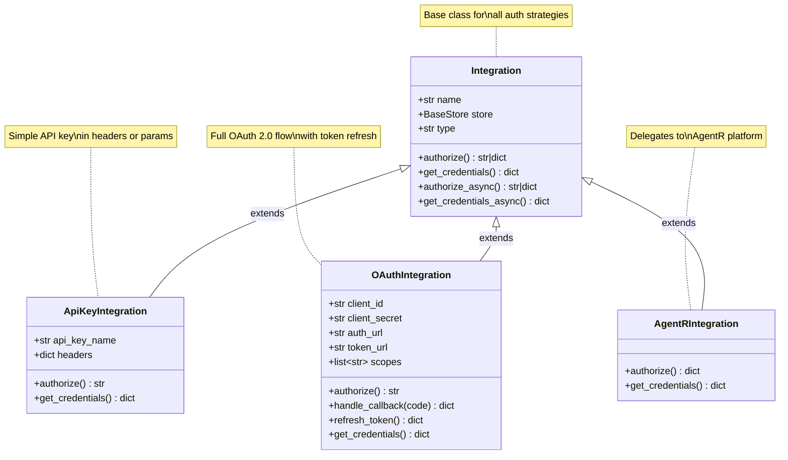
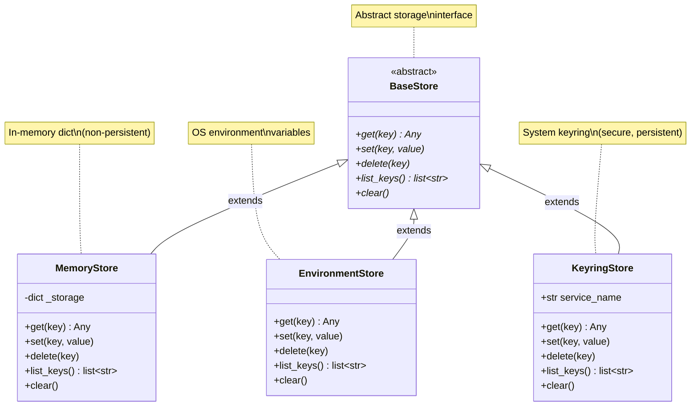
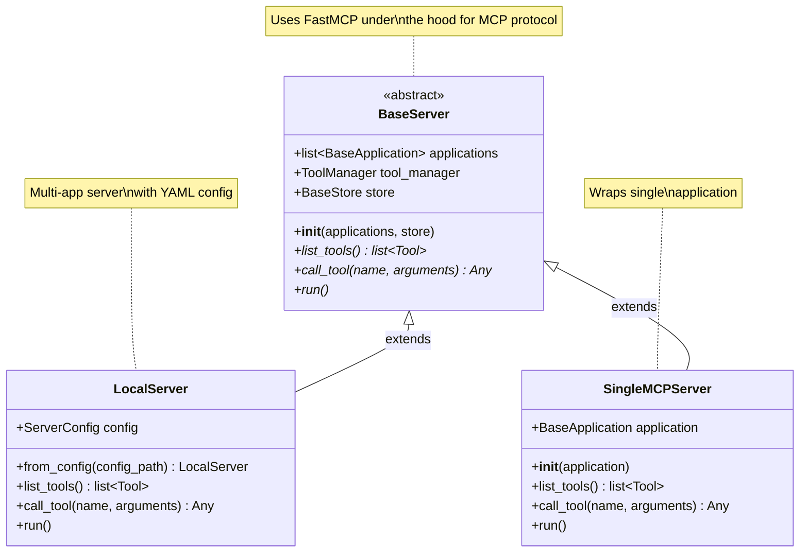
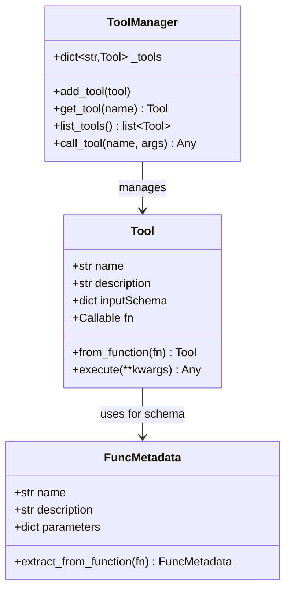

# Class Hierarchy

This page shows the inheritance relationships between core classes in universal-mcp using UML class diagrams.

## Overview

Universal-mcp uses inheritance to provide extensibility points for:
- **Applications** - Wrapping different API types
- **Integrations** - Supporting different auth mechanisms
- **Stores** - Using different credential storage backends
- **Servers** - Deploying different server configurations

## Application Hierarchy

### Key Points

- **BaseApplication**: Abstract base class that all applications must inherit from
  - Requires `list_tools()` method that returns callable functions
  - Each callable becomes a tool exposed to AI agents

- **APIApplication**: Base for REST API integrations
  - Manages httpx.Client for HTTP requests
  - Provides convenience methods (get, post, put, delete, patch)
  - Handles authentication headers via Integration

- **GraphQLApplication**: Base for GraphQL integrations
  - Manages GQL client
  - Provides query and mutation helpers
  - Also uses Integration for auth

## Integration Hierarchy

### Key Points

- **Integration**: Base class for authentication strategies
  - Stores credentials in a configurable Store
  - Provides both sync and async methods

- **ApiKeyIntegration**: Simplest auth method
  - Reads API key from store
  - Returns headers dict for requests

- **OAuthIntegration**: Full OAuth 2.0 implementation
  - Manages authorization flow
  - Handles token exchange and refresh
  - Stores access/refresh tokens

- **AgentRIntegration**: Platform integration
  - Credentials managed by AgentR platform
  - No local storage needed

## Store Hierarchy

### Key Points

- **BaseStore**: Abstract base for credential storage
  - Simple key-value interface
  - All stores provide same API

- **MemoryStore**: In-memory only
  - Good for testing
  - Lost on process exit

- **EnvironmentStore**: Uses os.environ
  - Read from environment variables
  - Can write but not persistent across sessions

- **KeyringStore**: Production storage
  - Uses system keyring (macOS Keychain, Windows Credential Manager, etc.)
  - Secure and persistent

## Server Hierarchy

### Key Points

- **BaseServer**: Abstract base built on FastMCP
  - Implements MCP protocol
  - Manages tool registry
  - Routes tool calls

- **LocalServer**: Configuration-driven server
  - Loads apps from YAML config
  - Supports multiple applications
  - Production deployment

- **SingleMCPServer**: Programmatic wrapper
  - Wraps one application
  - Simpler for single-app scenarios
  - Good for testing and development

## Tool System Classes

### Key Points

- **Tool**: Represents a callable tool
  - Wraps a Python function
  - Includes JSON schema for parameters
  - Handles execution

- **ToolManager**: Central tool registry
  - Stores all available tools
  - Routes tool calls by name
  - Thread-safe

- **FuncMetadata**: Schema extraction
  - Parses function docstrings
  - Generates JSON schemas from type hints
  - Maps Python types to JSON Schema types

## Relationships Summary

The class hierarchies provide clear extension points:

1. **Add new API type**: Extend `APIApplication` or `GraphQLApplication`
2. **Add auth method**: Extend `Integration`
3. **Add storage backend**: Extend `BaseStore`
4. **Add server type**: Extend `BaseServer`

All extensions automatically work with the existing tool system and MCP protocol implementation.
