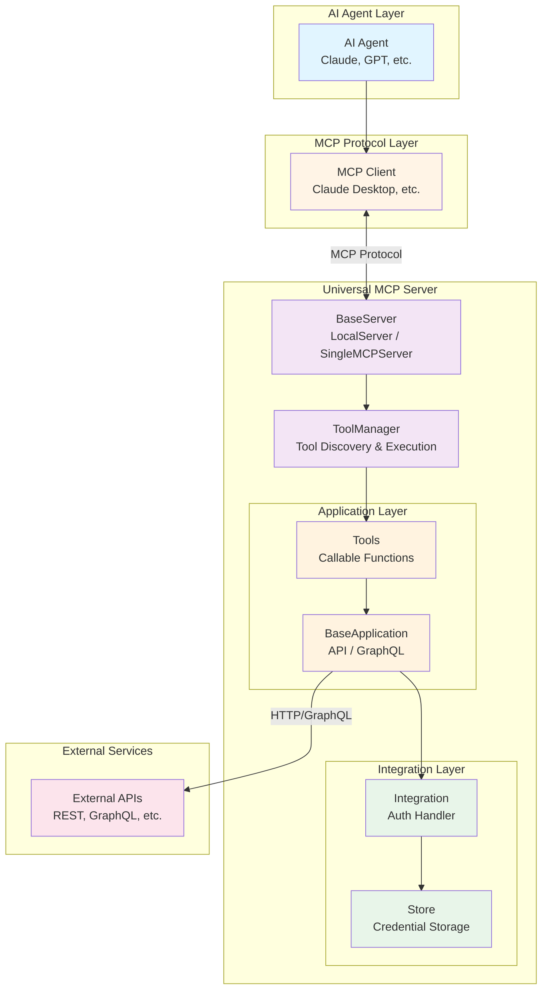

# System Architecture

This diagram shows the high-level architecture of universal-mcp and how components interact.

## Overview

Universal-mcp acts as middleware between AI agents (via MCP clients) and external applications/APIs. It handles authentication, credential storage, and tool registration/execution.

## Architecture Diagram

## Component Descriptions

### AI Agent Layer

- **AI Agent**: The LLM (Large Language Model) that needs to call external tools
- Examples: Claude, GPT-4, Gemini

### MCP Protocol Layer

- **MCP Client**: Implements the Model Context Protocol client
- Examples: Claude Desktop, VS Code extension
- Communicates with MCP servers using standard protocol

### Universal MCP Server

The core middleware layer with several key components:

#### Server Component

- **BaseServer**: Abstract base for MCP servers
- **LocalServer**: Multi-application server with YAML config
- **SingleMCPServer**: Wraps a single application

Responsibilities:
- Handle MCP protocol requests (list_tools, call_tool)
- Manage application lifecycle
- Route tool calls to appropriate handlers

#### Tool Management

- **ToolManager**: Central registry for tools
- **Tools**: Individual callable functions with schemas

Responsibilities:
- Discover tools from applications
- Parse docstrings to generate schemas
- Route tool calls to correct application

#### Integration Layer

- **Integration**: Handles authentication strategies
  - ApiKeyIntegration: Simple API key auth
  - OAuthIntegration: OAuth 2.0 flow
  - AgentRIntegration: Platform-managed credentials

- **Store**: Persists credentials securely
  - MemoryStore: Non-persistent (testing)
  - EnvironmentStore: OS environment variables
  - KeyringStore: System keyring (production)

Responsibilities:
- Manage authentication flows
- Store and retrieve credentials
- Inject auth into application requests

#### Application Layer

- **BaseApplication**: Abstract application interface
- **APIApplication**: REST API wrapper
- **GraphQLApplication**: GraphQL API wrapper

Responsibilities:
- Define available tools as Python functions
- Make authenticated requests to external APIs
- Parse responses and handle errors

### External Services

- **External APIs**: The actual services being integrated
- Examples: GitHub, Slack, Google Calendar, etc.

## Request Flow Summary

1. AI Agent needs to call a tool (e.g., "create_github_issue")
2. MCP Client sends tool call request to Universal MCP Server
3. Server routes to ToolManager
4. ToolManager finds the tool and invokes it
5. Tool calls the Application method
6. Application gets credentials from Integration/Store
7. Application makes authenticated HTTP/GraphQL request to External API
8. Response flows back through the stack
9. Result returned to AI Agent via MCP Client

For detailed sequence diagrams, see:
- [Request Flow](request-flow.md) - Detailed tool execution flow
- [Authentication Flow](auth-flow.md) - Credential retrieval patterns

## Configuration

Universal-mcp can be configured via:

1. **YAML Config Files** (LocalServer)
   - Define multiple applications
   - Configure integrations and stores
   - Set server options

2. **Environment Variables**
   - API keys and credentials
   - Server settings

3. **Programmatic Config** (SingleMCPServer)
   - Import applications as Python modules
   - Dynamic configuration

See [Configuration API](../api/config.md) for details.
