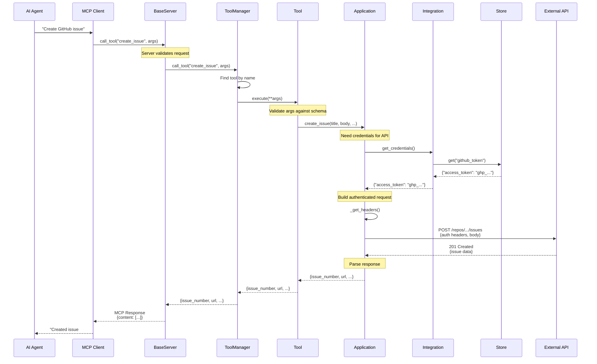
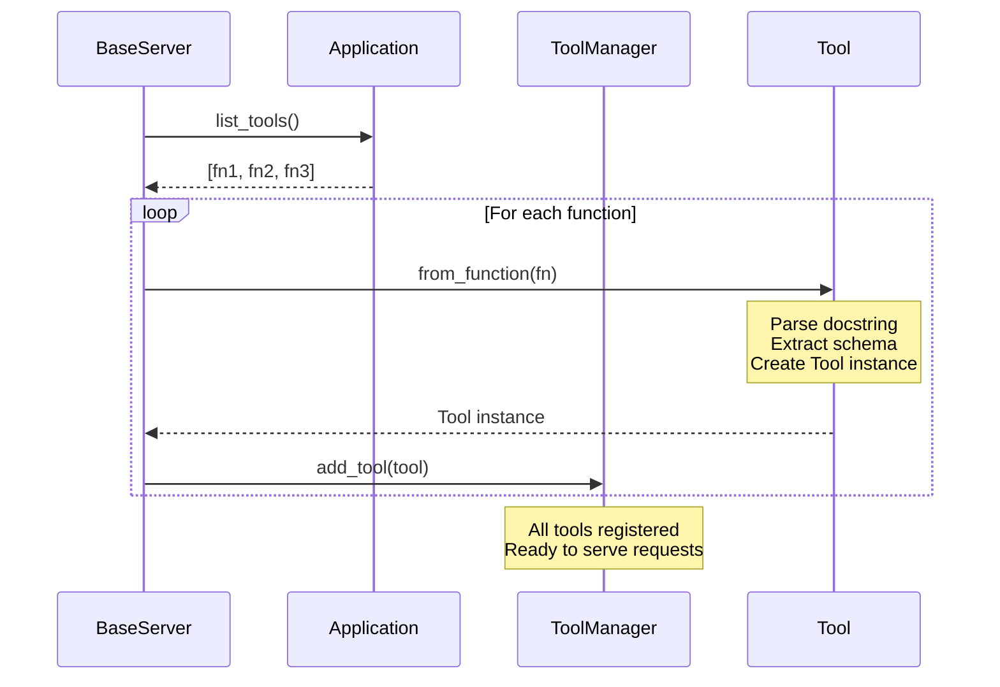
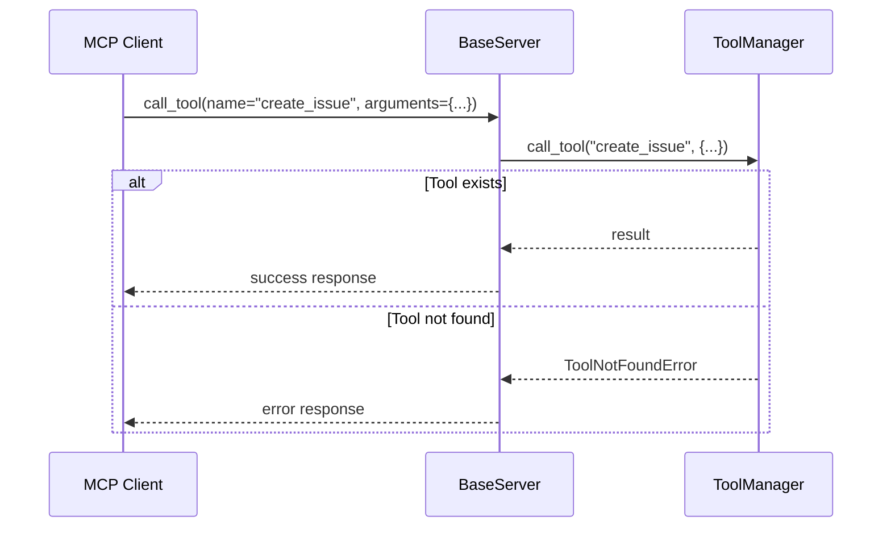
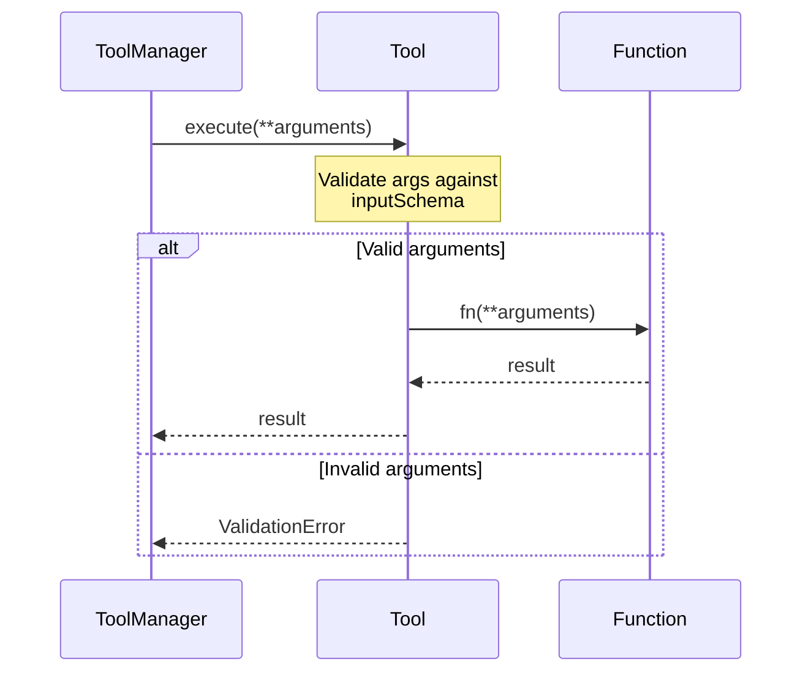
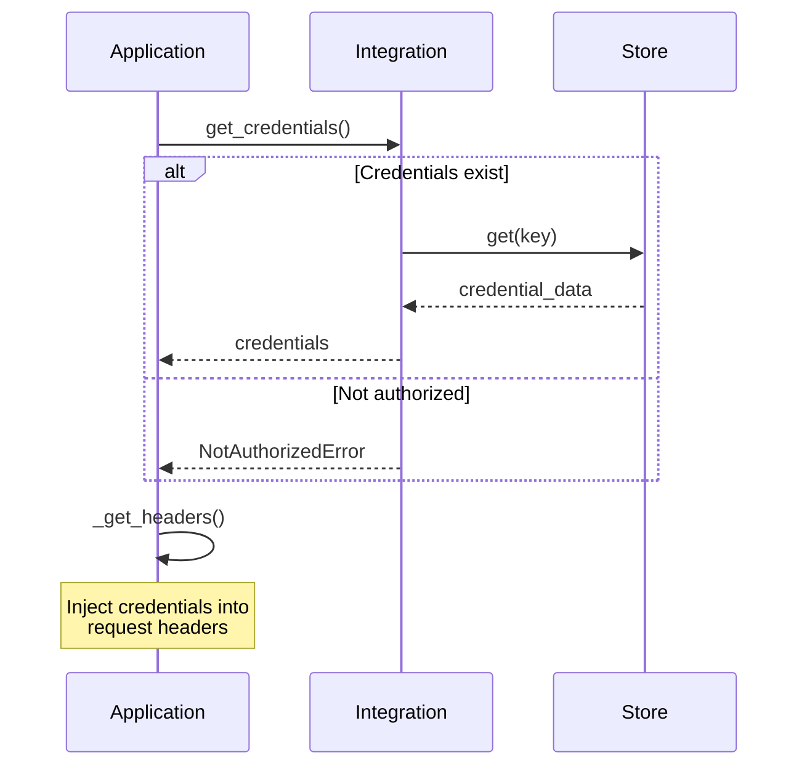
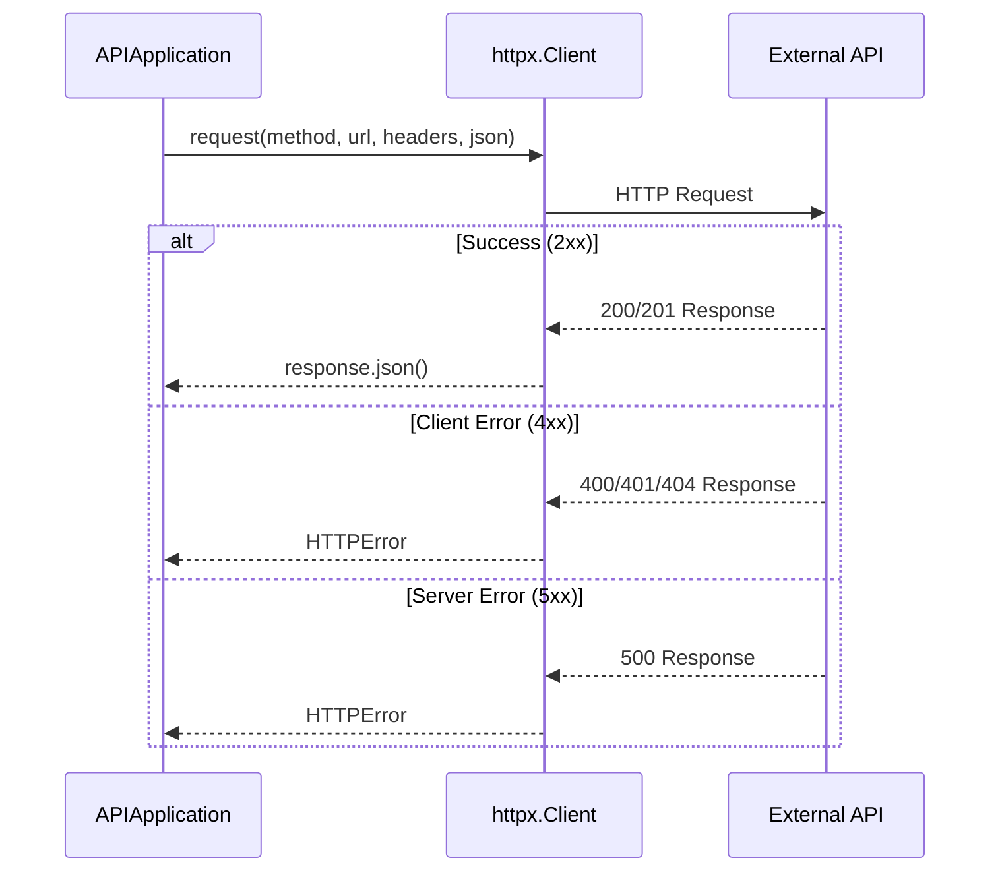
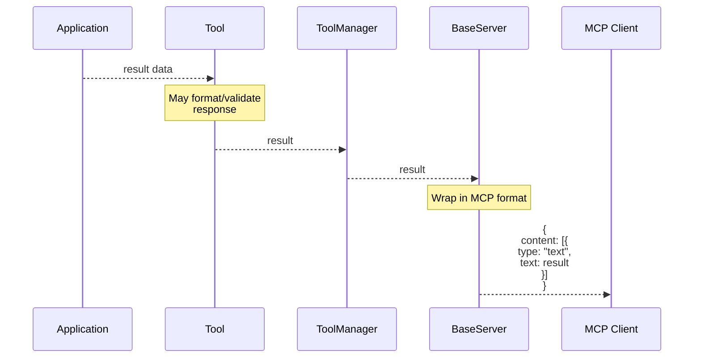
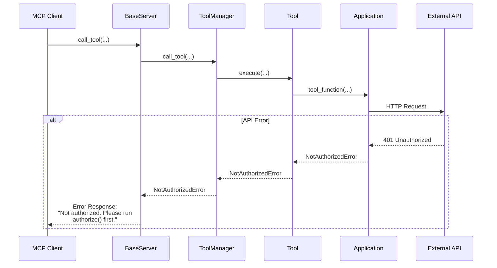

# Request Flow

This page shows the detailed sequence of events when an AI agent calls a tool through universal-mcp.

## Overview

When an AI agent wants to call a tool (e.g., "create a GitHub issue"), the request flows through multiple layers:
1. MCP Client → MCP Server
2. Server → Tool Manager
3. Tool Manager → Tool
4. Tool → Application
5. Application → Integration → Store (for credentials)
6. Application → External API
7. Response flows back up the chain

## Complete Request Flow

## Step-by-Step Breakdown

### 1. Tool Discovery (Initialization)

Before any tool can be called, it must be registered. This happens during server startup:

### 2. Tool Invocation

When the agent wants to call a tool:

### 3. Argument Validation

The Tool validates arguments against its JSON schema:

### 4. Authentication

The application retrieves credentials:

### 5. API Request

The application makes the external API call:

### 6. Response Processing

The response flows back up the stack:

## Error Handling

Errors at any layer are propagated back to the client:

## Performance Considerations

### Caching

- **Tool schemas**: Cached after first generation
- **HTTP connections**: Reused via httpx.Client
- **Credentials**: Cached in memory after first retrieval

### Async Support

Universal-mcp supports async/await for:
- `get_credentials_async()`
- `authorize_async()`
- Async application methods

This allows non-blocking I/O for better performance.

### Connection Pooling

APIApplication uses httpx.Client which:
- Maintains connection pool
- Reuses TCP connections
- Supports HTTP/2

## Related Documentation

- [Authentication Flow](auth-flow.md) - Details on credential retrieval
- [Tool Registration](tool-registration.md) - How tools are discovered
- [Server Initialization](server-init.md) - Server startup sequence
