# Server Initialization

This page documents the startup sequences for LocalServer and SingleMCPServer, showing how configuration is loaded and applications are initialized.

## Overview

Universal-mcp provides two server types:

1. **LocalServer** - Multi-application server configured via YAML
2. **SingleMCPServer** - Programmatic wrapper for a single application

Each has different initialization flows optimized for their use case.

## LocalServer Initialization

LocalServer loads multiple applications from a YAML configuration file.

### Complete Startup Flow

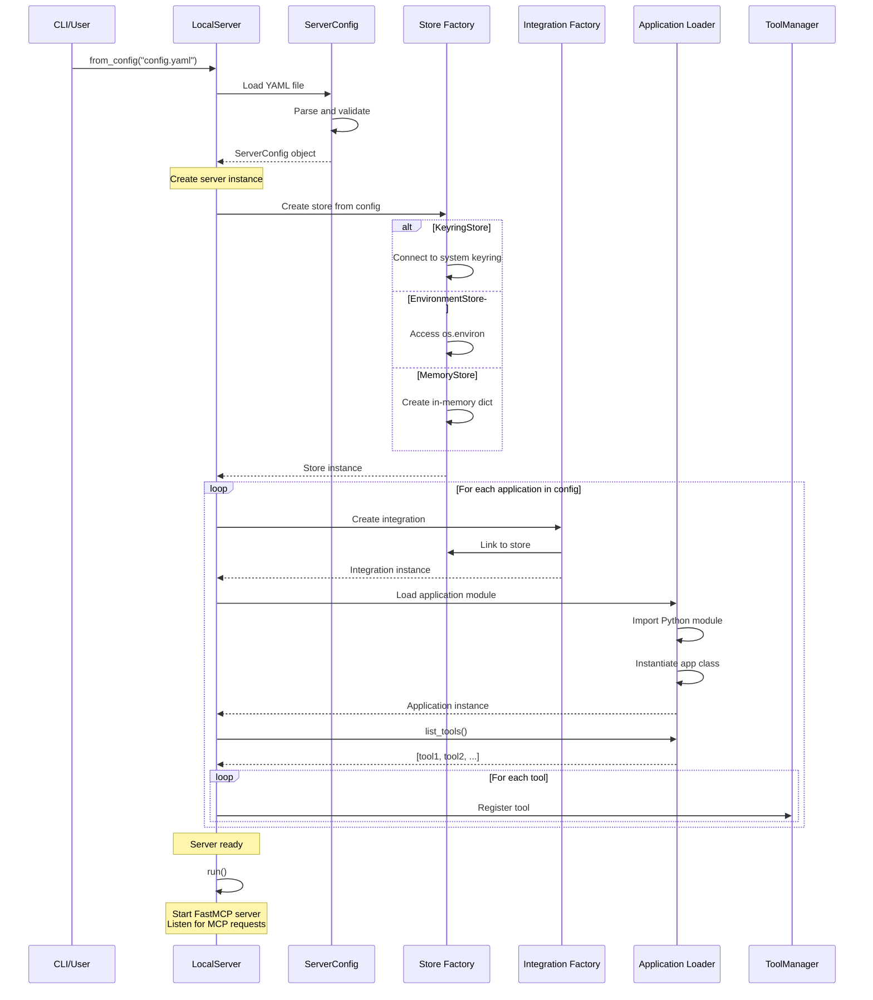

### Configuration Loading

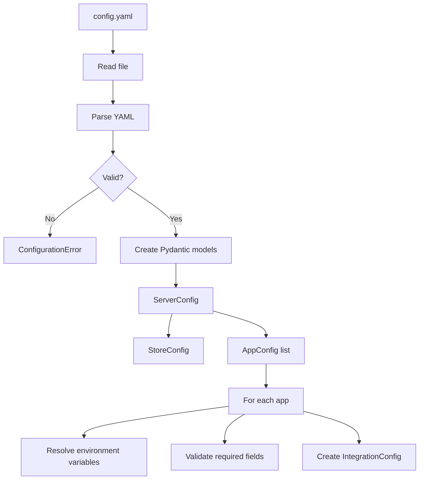

### Example Configuration

```yaml
# config.yaml
store:
  type: keyring
  service_name: universal-mcp

applications:
  - name: github
    module: universal_mcp.applications.github
    class_name: GitHubApp
    integration:
      type: oauth
      client_id: ${GITHUB_CLIENT_ID}
      client_secret: ${GITHUB_CLIENT_SECRET}
      auth_url: https://github.com/login/oauth/authorize
      token_url: https://github.com/login/oauth/access_token
      scopes:
        - repo
        - user

  - name: slack
    module: my_apps.slack_app
    class_name: SlackApp
    integration:
      type: api_key
      api_key_name: SLACK_BOT_TOKEN
      headers:
        Authorization: "Bearer {api_key}"
```

### Store Creation

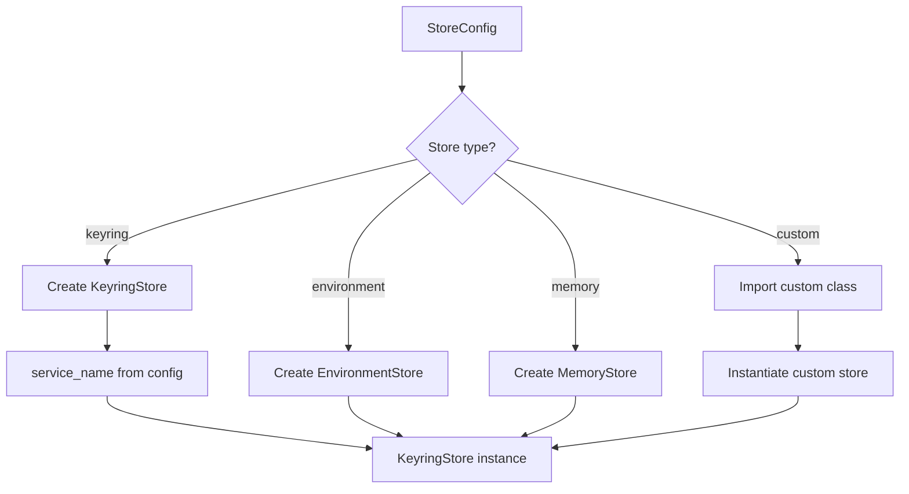

### Application Loading

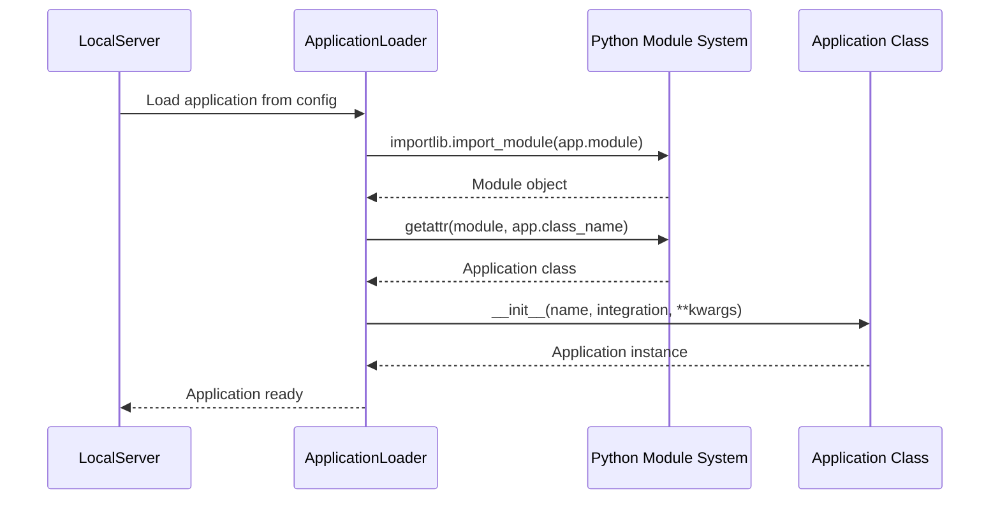

### Error Handling During Startup

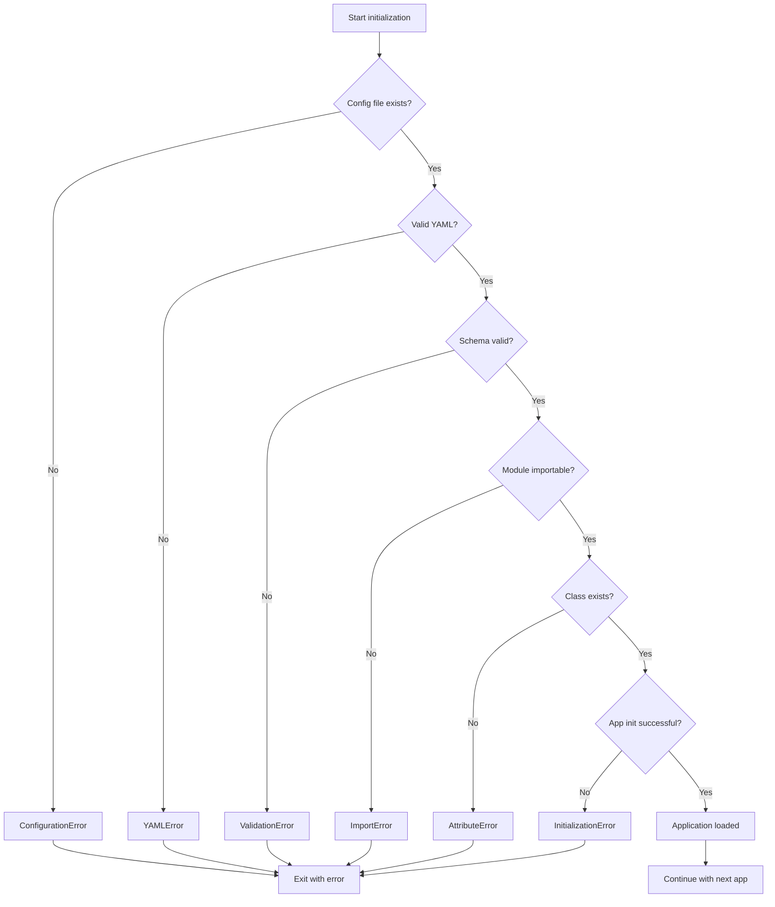

## SingleMCPServer Initialization

SingleMCPServer wraps a single application instance with minimal configuration.

### Startup Flow

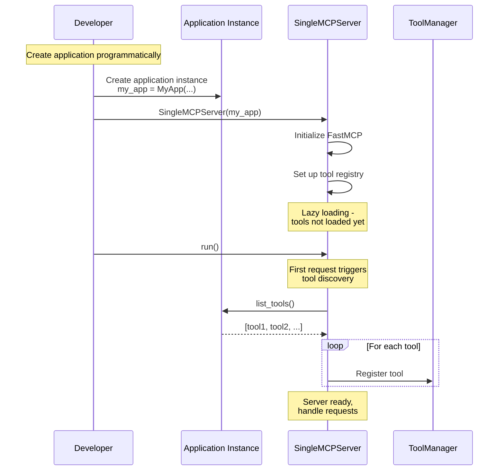

### Lazy Tool Loading

SingleMCPServer uses lazy loading for better performance:

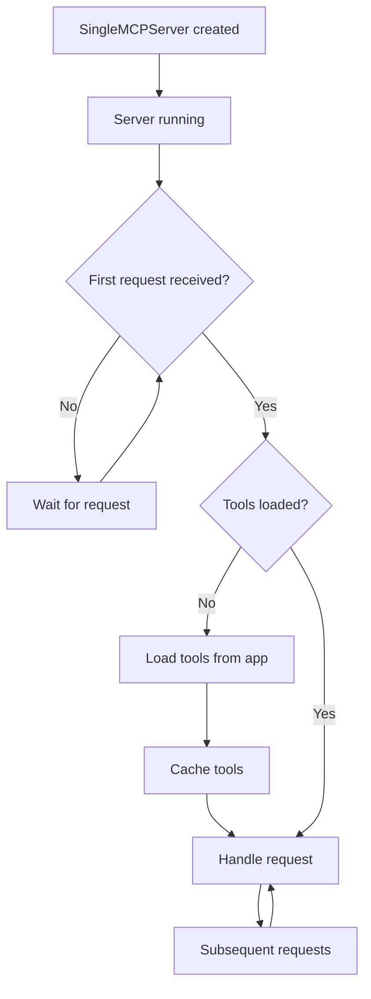

### Example Usage

```python
from universal_mcp.applications import APIApplication
from universal_mcp.servers import SingleMCPServer
from universal_mcp.integrations import ApiKeyIntegration
from universal_mcp.stores import KeyringStore

# Create store
store = KeyringStore(service_name="my-app")

# Create integration
integration = ApiKeyIntegration(
    name="my_api_key",
    store=store,
    api_key_name="MY_API_KEY"
)

# Create application
class MyApp(APIApplication):
    def __init__(self):
        super().__init__(
            name="my_app",
            integration=integration
        )
        self.base_url = "https://api.example.com"

    def list_tools(self):
        return [self.get_data]

    def get_data(self, query: str) -> dict:
        """Get data from API."""
        return self.get(f"/data?q={query}")

# Create and run server
app = MyApp()
server = SingleMCPServer(app)
server.run()  # Blocks and serves MCP requests
```

## Comparison: LocalServer vs SingleMCPServer

| Feature | LocalServer | SingleMCPServer |
|---------|-------------|-----------------|
| **Configuration** | YAML file | Programmatic |
| **Applications** | Multiple | Single |
| **Tool Loading** | Eager (at startup) | Lazy (on first request) |
| **Best For** | Production, multiple integrations | Development, testing |
| **Store Setup** | Configured in YAML | Passed to application |
| **Reload** | Requires restart | Requires restart |
| **Complexity** | Higher | Lower |

## Server Lifecycle

### LocalServer Lifecycle

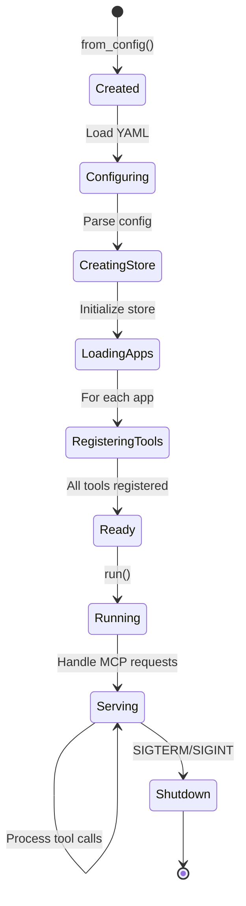

### SingleMCPServer Lifecycle

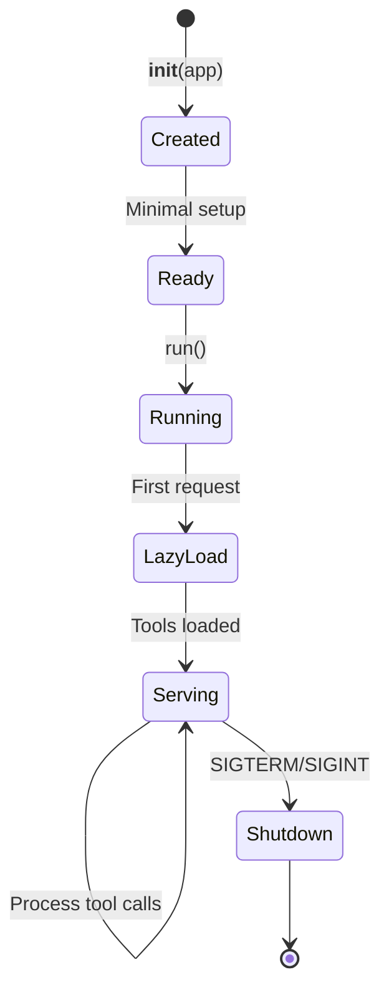

## Configuration Validation

LocalServer validates configuration at startup:

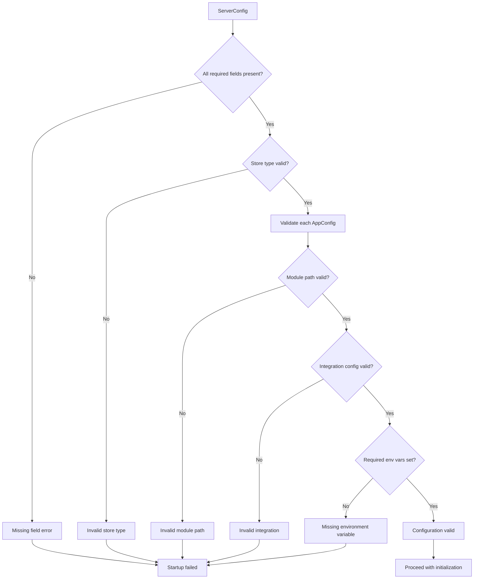

### Common Validation Errors

| Error | Cause | Solution |
|-------|-------|----------|
| `ConfigurationError` | Invalid YAML syntax | Fix YAML formatting |
| `ModuleNotFoundError` | Application module not found | Check module path, install package |
| `AttributeError` | Class name not found in module | Check class_name in config |
| `ValidationError` | Missing required field | Add required fields to config |
| `EnvironmentError` | Environment variable not set | Set required environment variables |

## Hot Reload (Future Feature)

Currently, both servers require restart for configuration changes. Future versions may support hot reload:

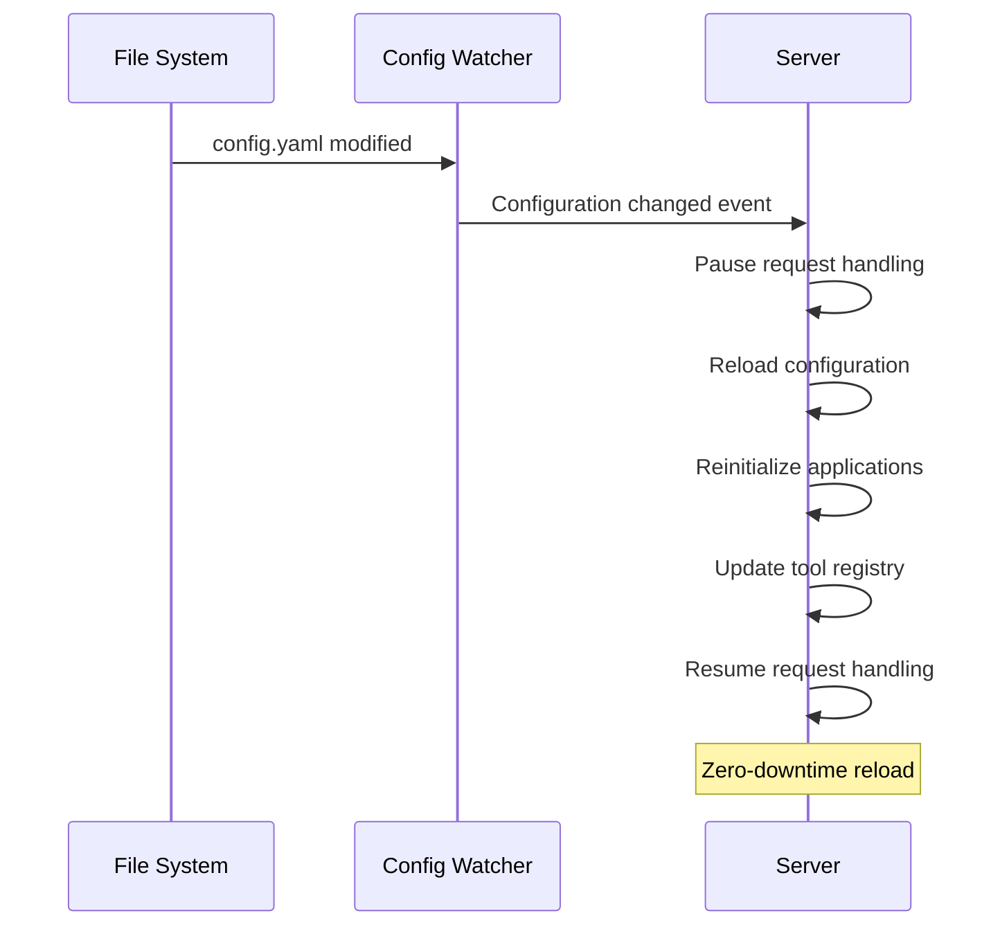

## Debugging Startup Issues

### Enable Debug Logging

```python
import logging
logging.basicConfig(level=logging.DEBUG)

# Then run server
server = LocalServer.from_config("config.yaml")
```

### Check Configuration

```python
from universal_mcp.config import ServerConfig

# Load and validate without starting server
config = ServerConfig.from_yaml("config.yaml")
print(config.model_dump_json(indent=2))
```

### Test Application Loading

```python
from universal_mcp.applications.utils import load_application

# Test loading a single app
app = load_application({
    "name": "test",
    "module": "my_module",
    "class_name": "MyApp"
})
print(f"Loaded: {app}")
print(f"Tools: {app.list_tools()}")
```

## Related Documentation

- [System Architecture](overview.md) - High-level architecture
- [Tool Registration](tool-registration.md) - What happens after initialization
- [Configuration API](../api/config.md) - Configuration schema reference
- [Servers API](../api/servers.md) - Server class reference
