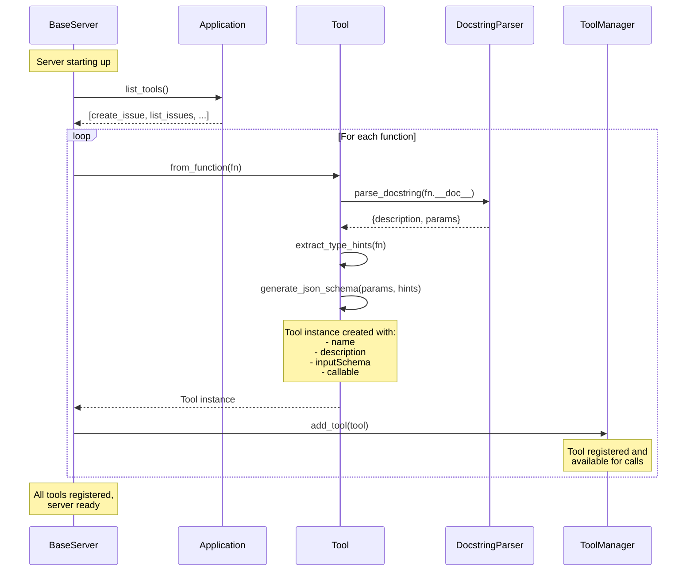
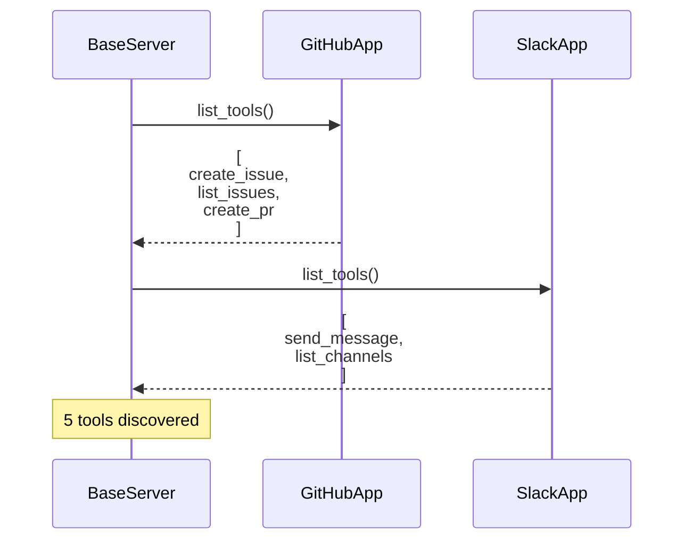
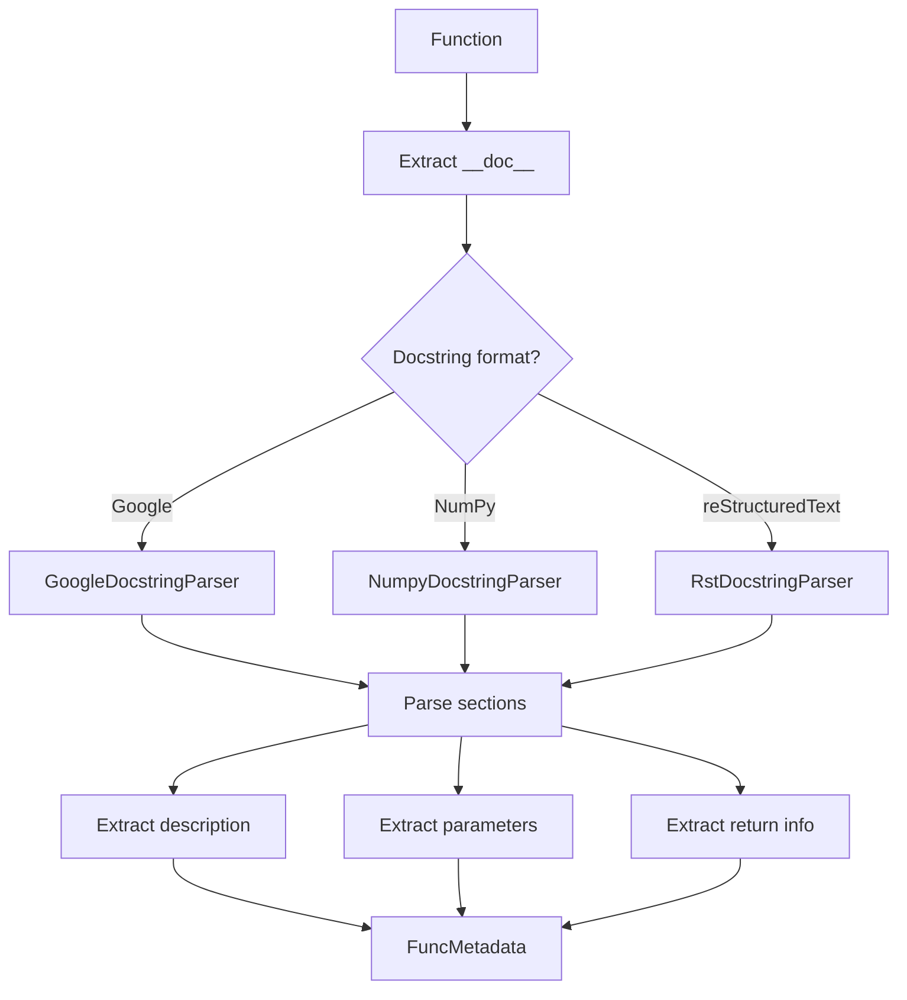
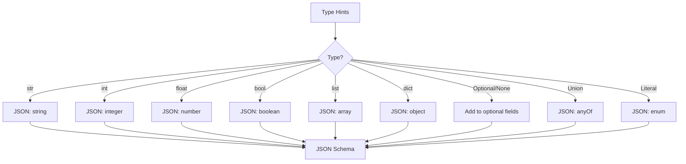
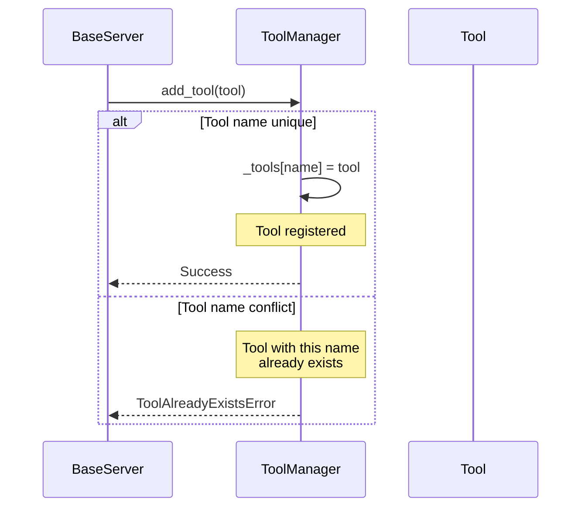

# Tool Registration

This page explains how universal-mcp discovers tools from applications, parses their schemas, and registers them for use by AI agents.

## Overview

Tool registration is the process of:
1. Discovering callable functions from applications
2. Parsing docstrings and type hints
3. Generating JSON schemas
4. Registering tools in the ToolManager

This happens during server initialization, before any tool calls are made.

## Complete Registration Flow



## Step 1: Application Discovery

During server initialization, each application is asked to list its tools:



### Application Implementation

Applications define tools as methods:

```python
class GitHubApp(APIApplication):
    def list_tools(self) -> list[Callable]:
        return [
            self.create_issue,
            self.list_issues,
            self.create_pull_request,
        ]

    def create_issue(
        self,
        title: str,
        body: str,
        labels: list[str] | None = None
    ) -> dict:
        """Create a new GitHub issue.

        Args:
            title: The issue title
            body: The issue description
            labels: Optional list of label names

        Returns:
            The created issue data including number and URL
        """
        # Implementation
```

## Step 2: Docstring Parsing

The Tool class parses docstrings to extract metadata:



### Supported Docstring Formats

Universal-mcp supports multiple docstring styles:

#### Google Style
```python
def create_issue(title: str, body: str) -> dict:
    """Create a new GitHub issue.

    Args:
        title: The issue title
        body: The issue description

    Returns:
        The created issue data
    """
```

#### NumPy Style
```python
def create_issue(title: str, body: str) -> dict:
    """Create a new GitHub issue.

    Parameters
    ----------
    title : str
        The issue title
    body : str
        The issue description

    Returns
    -------
    dict
        The created issue data
    """
```

#### reStructuredText Style
```python
def create_issue(title: str, body: str) -> dict:
    """Create a new GitHub issue.

    :param title: The issue title
    :param body: The issue description
    :return: The created issue data
    """
```

## Step 3: Type Hint Extraction

Python type hints are used to generate JSON Schema types:



### Type Mapping Examples

| Python Type | JSON Schema Type | Example |
|-------------|------------------|---------|
| `str` | `{"type": "string"}` | "hello" |
| `int` | `{"type": "integer"}` | 42 |
| `float` | `{"type": "number"}` | 3.14 |
| `bool` | `{"type": "boolean"}` | true |
| `list[str]` | `{"type": "array", "items": {"type": "string"}}` | ["a", "b"] |
| `dict[str, Any]` | `{"type": "object"}` | {"key": "value"} |
| `str \| None` | `{"type": "string"}` (optional) | "hello" or null |
| `Literal["a", "b"]` | `{"type": "string", "enum": ["a", "b"]}` | "a" |

## Step 4: Schema Generation

The complete JSON Schema for a tool is generated:

```mermaid
flowchart TD
    A[Function Metadata] --> B[Create Schema Object]

    C[Name] --> B
    D[Description] --> B
    E[Parameters] --> B

    B --> F[JSON Schema]

    F --> G[Tool Definition]
    G --> H[{<br/>name: string,<br/>description: string,<br/>inputSchema: object<br/>}]
```

### Example Schema

For this function:
```python
def create_issue(
    title: str,
    body: str,
    labels: list[str] | None = None
) -> dict:
    """Create a new GitHub issue.

    Args:
        title: The issue title
        body: The issue description
        labels: Optional list of label names
    """
```

Generated schema:
```json
{
  "name": "create_issue",
  "description": "Create a new GitHub issue",
  "inputSchema": {
    "type": "object",
    "properties": {
      "title": {
        "type": "string",
        "description": "The issue title"
      },
      "body": {
        "type": "string",
        "description": "The issue description"
      },
      "labels": {
        "type": "array",
        "items": {"type": "string"},
        "description": "Optional list of label names"
      }
    },
    "required": ["title", "body"]
  }
}
```

## Step 5: Tool Registration

Tools are registered in the ToolManager:



### Tool Namespacing

If multiple applications have tools with the same name, they can be namespaced:

```python
# Without namespace (conflict)
github.create_issue()
jira.create_issue()  # Conflict!

# With namespace
github_create_issue()
jira_create_issue()  # Unique names
```

Applications can prefix tool names:

```python
class GitHubApp(APIApplication):
    def list_tools(self) -> list[Callable]:
        tools = [self.create_issue, self.list_issues]
        # Add namespace prefix
        for tool in tools:
            tool.__name__ = f"github_{tool.__name__}"
        return tools
```

## Complete Example

Here's a complete example showing all steps:

### Application Definition

```python
from universal_mcp.applications import APIApplication
from typing import Literal

class WeatherApp(APIApplication):
    def list_tools(self):
        return [self.get_weather]

    def get_weather(
        self,
        city: str,
        units: Literal["metric", "imperial"] = "metric",
        include_forecast: bool = False
    ) -> dict:
        """Get current weather for a city.

        Args:
            city: City name (e.g., "London", "New York")
            units: Temperature units (metric for Celsius, imperial for Fahrenheit)
            include_forecast: Whether to include 5-day forecast

        Returns:
            Weather data including temperature, humidity, and conditions
        """
        # Implementation
        return self.get(f"/weather?q={city}&units={units}")
```

### Generated Tool

```json
{
  "name": "get_weather",
  "description": "Get current weather for a city",
  "inputSchema": {
    "type": "object",
    "properties": {
      "city": {
        "type": "string",
        "description": "City name (e.g., \"London\", \"New York\")"
      },
      "units": {
        "type": "string",
        "enum": ["metric", "imperial"],
        "description": "Temperature units (metric for Celsius, imperial for Fahrenheit)",
        "default": "metric"
      },
      "include_forecast": {
        "type": "boolean",
        "description": "Whether to include 5-day forecast",
        "default": false
      }
    },
    "required": ["city"]
  }
}
```

### MCP Tool Definition

This is exposed to MCP clients as:

```json
{
  "tools": [
    {
      "name": "get_weather",
      "description": "Get current weather for a city",
      "inputSchema": {
        "type": "object",
        "properties": {
          "city": {
            "type": "string",
            "description": "City name (e.g., \"London\", \"New York\")"
          },
          "units": {
            "type": "string",
            "enum": ["metric", "imperial"],
            "default": "metric"
          },
          "include_forecast": {
            "type": "boolean",
            "default": false
          }
        },
        "required": ["city"]
      }
    }
  ]
}
```

## Best Practices

### 1. Write Clear Docstrings

```python
# Good
def create_issue(title: str, body: str) -> dict:
    """Create a new GitHub issue.

    Args:
        title: The issue title (max 256 characters)
        body: The issue description (supports Markdown)

    Returns:
        Created issue data with number and URL
    """

# Bad
def create_issue(title: str, body: str) -> dict:
    """Creates issue."""  # Too brief, no parameter docs
```

### 2. Use Type Hints

```python
# Good
def search_repos(
    query: str,
    language: str | None = None,
    max_results: int = 10
) -> list[dict]:

# Bad
def search_repos(query, language=None, max_results=10):
    # No type hints means no schema validation
```

### 3. Use Literal for Enums

```python
# Good - generates enum in schema
from typing import Literal

def set_priority(
    issue_id: int,
    priority: Literal["low", "medium", "high", "critical"]
) -> dict:

# Bad - any string accepted
def set_priority(issue_id: int, priority: str) -> dict:
```

### 4. Document Return Types

```python
# Good
def get_user(username: str) -> dict:
    """Fetch user profile.

    Returns:
        dict: User data containing:
            - id (int): User ID
            - username (str): Username
            - email (str): Email address
    """

# Bad
def get_user(username: str) -> dict:
    """Fetch user profile."""
    # No info about return structure
```

## Debugging Tool Registration

If tools aren't appearing:

1. **Check list_tools() returns callables**
   ```python
   tools = app.list_tools()
   assert all(callable(t) for t in tools)
   ```

2. **Verify docstrings exist**
   ```python
   for tool in tools:
       assert tool.__doc__ is not None
   ```

3. **Check type hints**
   ```python
   import inspect
   sig = inspect.signature(tool)
   for param in sig.parameters.values():
       assert param.annotation != inspect.Parameter.empty
   ```

4. **Enable debug logging**
   ```python
   import logging
   logging.getLogger("universal_mcp").setLevel(logging.DEBUG)
   ```

## Related Documentation

- [Class Hierarchy](class-hierarchy.md) - Tool and ToolManager classes
- [Request Flow](request-flow.md) - How tools are invoked
- [Tools API](../api/tools.md) - Tool class reference
